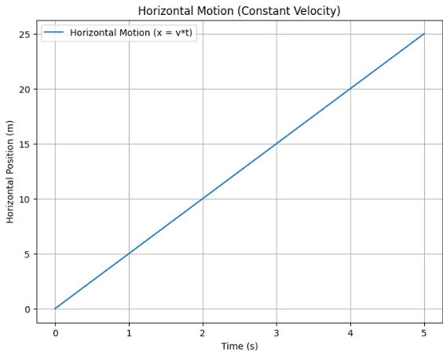
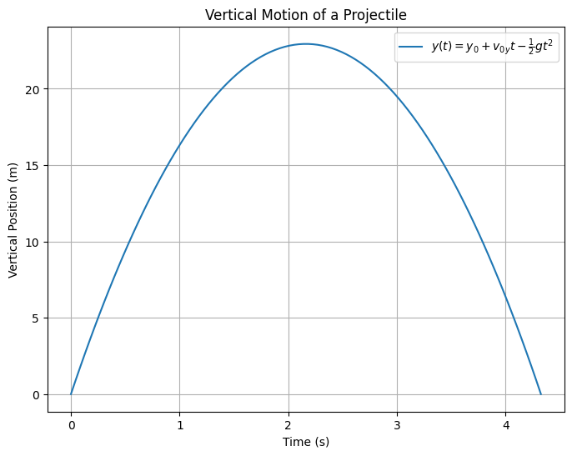
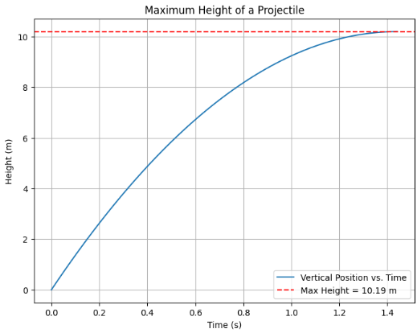
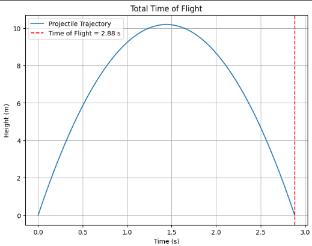
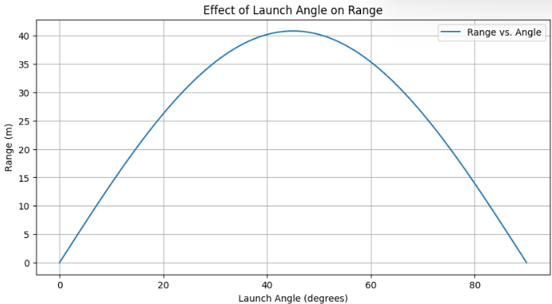
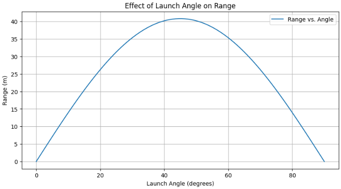
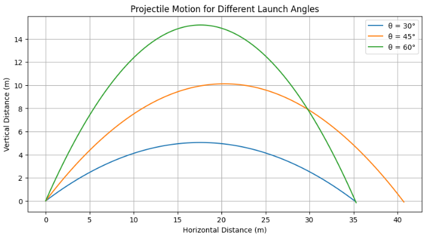

# **Projectile Motion: A Theoretical and Computational Study**

## **1. Introduction**
Projectile motion is a fundamental topic in classical mechanics that describes the motion of an object launched into the air, subject to gravitational acceleration. It plays a crucial role in understanding various real-world phenomena, from the trajectory of a thrown ball to the path of a rocket. The motion of a projectile can be decomposed into independent horizontal and vertical components, governed by well-established kinematic equations. These equations provide valuable insights into the relationship between velocity, acceleration, time, and displacement.

This study aims to delve into the mathematical foundations of projectile motion, systematically deriving its governing equations from Newton’s laws of motion. By exploring the dependence of range, time of flight, and maximum height on initial launch conditions, we will demonstrate how these factors interact to shape the projectile’s path.

Furthermore, we will analyze how variations in initial velocity, gravitational acceleration, and launch height influence the overall motion, leading to a diverse set of outcomes. A computational approach will be employed to simulate and visualize projectile trajectories, enabling a deeper understanding of the theoretical principles through numerical methods. By combining analytical derivations with computational techniques, we aim to bridge the gap between theoretical physics and real-world applications, demonstrating the practical significance of projectile motion across various disciplines, including sports, engineering, and astrophysics.

---

## **2. Governing Equations of Motion**
Projectile motion is governed by Newton’s laws of motion. To describe its behavior, we break it down into two components: **horizontal motion** and **vertical motion**.

### **2.1 Horizontal Motion**
The horizontal component of projectile motion is characterized by the absence of acceleration (assuming air resistance is negligible). The velocity in this direction remains constant:

[ x = v_0 \cos(\theta) t ]

where:
- ( x ) is the horizontal displacement,
- ( v_0 ) is the initial velocity,
- ( \theta ) is the launch angle,
- ( t ) is the time elapsed.

Since there is no horizontal acceleration:

[ v_x = v_0 \cos(\theta) ]

This means the projectile maintains a constant horizontal velocity throughout its flight.
def plot_horizontal_motion():
    time = np.linspace(0, 5, 100)
    x = 5 * time  # Constant velocity motion

    plt.figure(figsize=(8, 6))
    plt.plot(time, x, label="Horizontal Motion (x = v*t)")
    plt.xlabel("Time (s)")
    plt.ylabel("Horizontal Position (m)")
    plt.title("Horizontal Motion (Constant Velocity)")
    plt.legend()
    plt.grid()
    plt.savefig("horizontal_motion.png")
    plt.show()

plot_horizontal_motion()


### **2.2 Vertical Motion**

In projectile motion, the vertical component is influenced by gravity, which causes the projectile to decelerate as it rises and accelerate as it falls back down. This is due to the gravitational force acting downward, pulling the projectile toward the ground.
In projectile motion, the vertical component is influenced by gravity, which causes the projectile to decelerate as it rises and accelerate as it falls back down. This is due to the gravitational force acting downward, pulling the projectile toward the ground.  

Unlike the horizontal motion, which remains constant (ignoring air resistance), the vertical motion is affected by acceleration due to gravity. This results in a parabolic trajectory, where the object reaches a maximum height before descending back to the ground.  

### **Vertical Position**
The vertical position ( y(t) ) at any given time ( t ) is described by the following kinematic equation:

$$
y(t) = y_0 + v_0 sin(theta) t - \frac{1}{2} g t^2
$$

Where:
- ( y_0 ) is the initial height of the projectile,
- ( v_0 \sin(\theta) ) is the vertical component of the initial velocity (the vertical velocity at ( t = 0 )),
- ( g ) is the acceleration due to gravity (approximately **9.81 m/s²**).

### **Vertical Velocity**
The vertical velocity ( v_y(t) ) at any given time ( t ) is given by:

$$
v_y(t) = v_0 sin(theta) - g t
$$

This equation shows that at the start of the motion, the vertical velocity is positive (the object moves upward), but as time progresses, gravity slows down the upward motion. Once the projectile reaches its maximum height, the vertical velocity becomes zero. After that, gravity causes the projectile to accelerate downward.
```python
import numpy as np
import matplotlib.pyplot as plt

# Constants
g = 9.81  # Gravity (m/s^2)
v0 = 30   # Initial velocity (m/s)
theta = 45  # Launch angle (degrees)
y0 = 0  # Initial height (m)

# Convert angle to radians
theta_rad = np.radians(theta)

# Initial vertical velocity
v0y = v0 * np.sin(theta_rad)

# Time array (from t=0 to when projectile hits the ground)
t_max = (2 * v0y) / g  
time = np.linspace(0, t_max, num=100)

# Vertical position equation
y = y0 + v0y * time - 0.5 * g * time**2

# Plot vertical motion
plt.figure(figsize=(8, 6))
plt.plot(time, y, label=r'$y(t) = y_0 + v_{0y} t - \frac{1}{2} g t^2$', color='b')
plt.axhline(0, color='gray', linestyle='--', linewidth=1)  # Ground level
plt.xlabel("Time (s)")
plt.ylabel("Vertical Position (m)")
plt.title("Vertical Motion of a Projectile")
plt.legend()
plt.grid()
plt.show()
---

### **2.3 Maximum Height**
The projectile reaches its maximum height ( H ) when ( v_y = 0 ):

[ 0 = v_0 \sin(\theta) - g t_H ]

Solving for ( t_H ) (time to reach maximum height):

[ t_H = \frac{v_0 \sin(\theta)}{g} ]

Substituting this into the vertical displacement equation:

[ H = \frac{(v_0 \sin(\theta))^2}{2g} ]
def plot_maximum_height():
    theta = np.radians(45)  # 45-degree launch
    v0 = 20  # Initial speed
    g = 9.81  # Define g here
    t_h = (v0 * np.sin(theta)) / g  # Time to reach max height
    H = (v0**2 * np.sin(theta)**2) / (2 * g)  # Maximum height

    plt.figure(figsize=(8, 6))
    time = np.linspace(0, t_h, 100)
    y = v0 * np.sin(theta) * time - 0.5 * g * time**2
    plt.plot(time, y, label="Vertical Position vs. Time")

    plt.axhline(H, color='r', linestyle="--", label=f"Max Height = {H:.2f} m")
    plt.xlabel("Time (s)")
    plt.ylabel("Height (m)")
    plt.title("Maximum Height of a Projectile")
    plt.legend()
    plt.grid()
    plt.savefig("maximum_height.png")
    plt.show()

plot_maximum_height()


### **2.4 Time of Flight**
The total time of flight ( T ) is found by setting ( y = 0 ):

[ 0 = y_0 + v_0 \sin(\theta) T - \frac{1}{2} g T^2 ]

Solving for ( T ), when launched from ground level (( y_0 = 0 )):

[ T = \frac{2 v_0 \sin(\theta)}{g} ]

For nonzero initial height, a quadratic equation must be solved.

---
def plot_time_of_flight():
    v0 = 20
    theta = np.radians(45)
    g = 9.81  # Define g within the function
    T = (2 * v0 * np.sin(theta)) / g  # Total flight time

    time = np.linspace(0, T, 100)
    y = v0 * np.sin(theta) * time - 0.5 * g * time**2

    plt.figure(figsize=(8, 6))
    plt.plot(time, y, label="Projectile Trajectory")
    plt.axvline(T, color='r', linestyle="--", label=f"Time of Flight = {T:.2f} s")
    plt.xlabel("Time (s)")
    plt.ylabel("Height (m)")
    plt.title("Total Time of Flight")
    plt.legend()
    plt.grid()
    plt.savefig("time_of_flight.png")
    plt.show()

plot_time_of_flight()


## **3. Analysis of Range Dependence on Launch Angle**
The horizontal range ( R ) is given by:

[ R = frac{v_0^2 sin(2\theta)}{g} ]

- The range is maximized when ( theta = 45^circ ).
- Increasing initial velocity increases the range quadratically.
- If the launch height is nonzero, a more complex formula is required.

The following Python code simulates the effect of launch angle on range:

```python
import numpy as np
import matplotlib.pyplot as plt

def projectile_range(theta, v0, g=9.81):
    theta_rad = np.radians(theta)
    return (v0**2 * np.sin(2 * theta_rad)) / g

angles = np.linspace(0, 90, 100)
ranges = [projectile_range(theta, 20) for theta in angles]

plt.figure(figsize=(10, 5))
plt.plot(angles, ranges, label='Range vs. Angle')
plt.xlabel('Launch Angle (degrees)')
plt.ylabel('Range (m)')
plt.title('Effect of Launch Angle on Range')
plt.legend()
plt.grid()
plt.show()
```

---

## **4. Computational Implementation**
A computational approach is useful to visualize projectile motion. The following script simulates projectile motion for different launch angles:

```python
import numpy as np
import matplotlib.pyplot as plt

def projectile_trajectory(theta, v0, g=9.81, dt=0.01):
    theta_rad = np.radians(theta)
    vx = v0 * np.cos(theta_rad)
    vy = v0 * np.sin(theta_rad)
    
    x, y = [0], [0]
    while y[-1] >= 0:
        vy = vy - g * dt
        x.append(x[-1] + vx * dt)
        y.append(y[-1] + vy * dt)
    
    return x, y

angles = [30, 45, 60]
plt.figure(figsize=(10, 5))
for angle in angles:
    x, y = projectile_trajectory(angle, 20)
    plt.plot(x, y, label=f'θ = {angle°')

plt.xlabel('Horizontal Distance (m)')
plt.ylabel('Vertical Distance (m)')
plt.title('Projectile Motion for Different Launch Angles')
plt.legend()
plt.grid()
plt.show()
```

---

## **5. Limitations and Further Considerations**
Several real-world factors influence projectile motion:
1. **Air Resistance**: Causes deviation from ideal parabolic trajectory.
2. **Wind Effects**: Can alter range and direction.
3. **Variable Gravity**: Relevant for planetary or space applications.

A more realistic model requires solving numerical differential equations.

---

## **6. Conclusion**
Projectile motion provides insights into fundamental physics. Key findings include:
- The optimal angle for maximum range is **45°**.
- Higher initial velocity increases range quadratically.
- Computational simulations confirm theoretical predictions.

Expanding this study to include air resistance and wind effects would improve realism and applicability in engineering and physics.


```

This means the projectile maintains a constant horizontal velocity throughout its flight.

### **2.2 Vertical Motion**
In contrast to horizontal motion, the vertical component is affected by gravitational acceleration (( g )), causing the projectile to slow down on the way up and speed up on the way down. The vertical position ( y ) at any time ( t ) is given by the kinematic equation:

```math
y = y_0 + v_0 sin(theta) t - \frac{1}{2} g t^2
```

where:
- ( y_0 ) is the initial height of the projectile,
- ( v_0 \sin(\theta) ) is the initial vertical velocity component.

The vertical velocity at any time ( t ) is:

```math
v_y = v_0 sin(theta) - g t
```

### **2.3 Maximum Height**
The projectile reaches its maximum height ( H ) when ( v_y = 0 ):

```math
0 = v_0 sin(theta) - g t_H
```

Solving for ( t_H ) (time to reach maximum height):

```math
t_H = \frac{v_0 \sin(\theta)}{g}
```

Substituting this into the vertical displacement equation:

```math
H = \frac{(v_0 sin(theta))^2}{2g}
```

### **2.4 Time of Flight**
The total time of flight ( T ) is found by setting ( y = 0 ):

```math
0 = y_0 + v_0 sin(theta) T - \frac{1}{2} g T^2
```

Solving for ( T ), when launched from ground level (( y_0 = 0 )):

```math
T = \frac{2 v_0 sin(theta)}{g}
```

For nonzero initial height, a quadratic equation must be solved.

---

## **3. Analysis of Range Dependence on Launch Angle**
The horizontal range ( R ) is given by:

```math
R = \frac{v_0^2 sin(2theta)}{g}
```

- The range is maximized when ( \theta = 45^\circ ).
- Increasing initial velocity increases the range quadratically.
- If the launch height is nonzero, a more complex formula is required.

The following Python code simulates the effect of launch angle on range:

```python
import numpy as np
import matplotlib.pyplot as plt

def projectile_range(theta, v0, g=9.81):
    theta_rad = np.radians(theta)
    return (v0**2 * np.sin(2 * theta_rad)) / g

angles = np.linspace(0, 90, 100)
ranges = [projectile_range(theta, 20) for theta in angles]

plt.figure(figsize=(10, 5))
plt.plot(angles, ranges, label='Range vs. Angle')
plt.xlabel('Launch Angle (degrees)')
plt.ylabel('Range (m)')
plt.title('Effect of Launch Angle on Range')
plt.legend()
plt.grid()
plt.show()
```

---

## **4. Computational Implementation**
A computational approach is useful to visualize projectile motion. The following script simulates projectile motion for different launch angles:

```python
import numpy as np
import matplotlib.pyplot as plt

def projectile_trajectory(theta, v0, g=9.81, dt=0.01):
    theta_rad = np.radians(theta)
    vx = v0 * np.cos(theta_rad)
    vy = v0 * np.sin(theta_rad)
    
    x, y = [0], [0]
    while y[-1] >= 0:
        vy = vy - g * dt
        x.append(x[-1] + vx * dt)
        y.append(y[-1] + vy * dt)
    
    return x, y

angles = [30, 45, 60]
plt.figure(figsize=(10, 5))
for angle in angles:
    x, y = projectile_trajectory(angle, 20)
    plt.plot(x, y, label=f'θ = {angle}°')

plt.xlabel('Horizontal Distance (m)')
plt.ylabel('Vertical Distance (m)')
plt.title('Projectile Motion for Different Launch Angles')
plt.legend()
plt.grid()
plt.show()
```

---

## **5. Limitations and Further Considerations**
Several real-world factors influence projectile motion:
1. **Air Resistance**: Causes deviation from ideal parabolic trajectory.
2. **Wind Effects**: Can alter range and direction.
3. **Variable Gravity**: Relevant for planetary or space applications.

A more realistic model requires solving numerical differential equations.

---

## **6. Conclusion**
Projectile motion provides insights into fundamental physics. Key findings include:
- The optimal angle for maximum range is **45°**.
- Higher initial velocity increases range quadratically.
- Computational simulations confirm theoretical predictions.

Expanding this study to include air resistance and wind effects would improve realism and applicability in engineering and physics.
```

