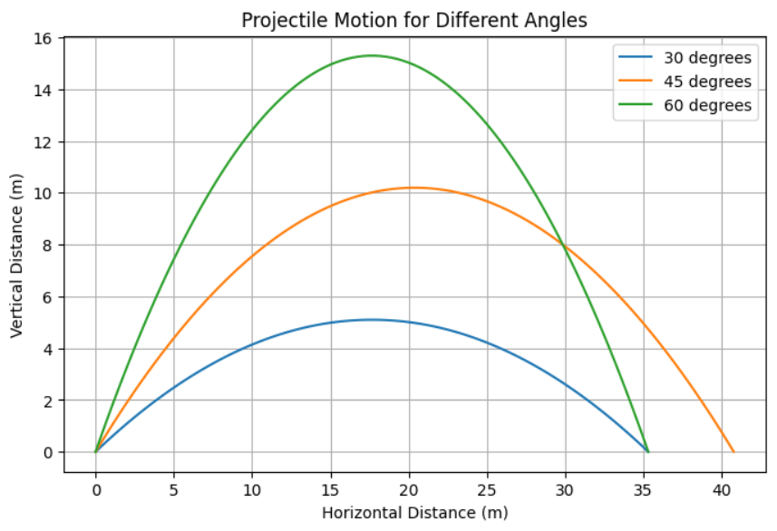

# Projectile Motion: Theoretical and Computational Analysis

## 1. Theoretical Foundation

Projectile motion follows Newton’s laws of motion. Assuming no air resistance, the motion can be decomposed into horizontal and vertical components.

### Governing Equations

From kinematic equations:
- Horizontal motion:
  [ x = v_0 \cos\theta \cdot t ]
- Vertical motion:
  [ y = v_0 \sin\theta \cdot t - \frac{1}{2} g t^2 ]

where:
- ( v_0 ) is the initial velocity
- ( \theta ) is the launch angle
- ( g ) is the gravitational acceleration
- ( t ) is time

### Time of Flight
The time to reach the ground (( y = 0 )):
[
t_f = \frac{2 v_0 \sin\theta}{g}
]

### Range Equation
The horizontal range ( R ) is given by:
[
R = \frac{v_0^2 \sin 2\theta}{g}
]

## 2. Analysis of the Range

The range depends on the launch angle ( \theta ), initial velocity ( v_0 ), and gravitational acceleration ( g ). The optimal angle for maximum range is ( 45^\circ ).

Let's visualize this with Python.

```python
import numpy as np
import matplotlib.pyplot as plt

g = 9.81  # gravity (m/s^2)
v0 = 20   # initial velocity (m/s)
theta = np.linspace(0, 90, 100)  # angles in degrees

# Convert angles to radians
theta_rad = np.radians(theta)

# Compute range
R = (v0**2 * np.sin(2*theta_rad)) / g

# Plot
plt.figure(figsize=(8, 5))
plt.plot(theta, R, label='Range vs Angle', color='b')
plt.xlabel('Launch Angle (degrees)')
plt.ylabel('Range (m)')
plt.title('Projectile Range vs. Launch Angle')
plt.legend()
plt.grid()
plt.show()
```


## 3. Practical Applications

Projectile motion applies to:
- Sports (e.g., basketball, soccer)
- Military applications (trajectory of missiles)
- Engineering (ballistic flight paths)

## 4. Implementation


```python
import numpy as np
import matplotlib.pyplot as plt

def projectile_motion(v0, theta, g=9.81):
    theta_rad = np.radians(theta)
    t_flight = (2 * v0 * np.sin(theta_rad)) / g
    t = np.linspace(0, t_flight, num=100)
    x = v0 * np.cos(theta_rad) * t
    y = v0 * np.sin(theta_rad) * t - 0.5 * g * t**2
    return x, y

# Simulate for different angles
angles = [30, 45, 60]
plt.figure(figsize=(8, 5))
for angle in angles:
    x, y = projectile_motion(20, angle)
    plt.plot(x, y, label=f'(angle) degrees')

plt.xlabel('Horizontal Distance (m)')
plt.ylabel('Vertical Distance (m)')
plt.title('Projectile Motion for Different Angles')
plt.legend()
plt.grid()
plt.show()
```

## Discussion

The idealized model assumes no air resistance, which isn't realistic for long-range motion. A more advanced model would incorporate drag force ( F_d = \frac{1}{2} C_d \rho A v^2 ) to account for air resistance.

## Conclusion

This study provides insight into projectile motion, demonstrating theoretical derivations and computational simulations. The next step would be incorporating wind resistance and varying terrains for a more realistic analysis.