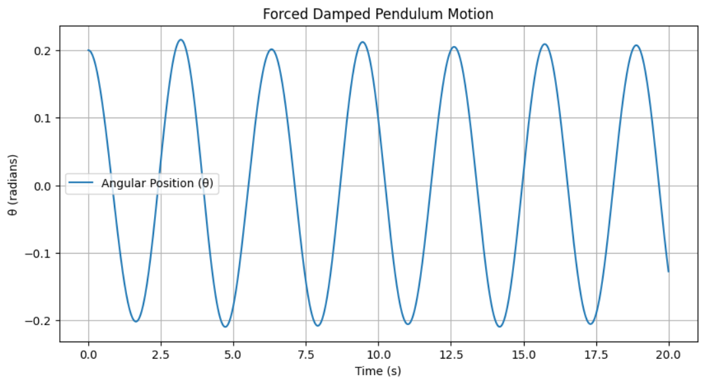
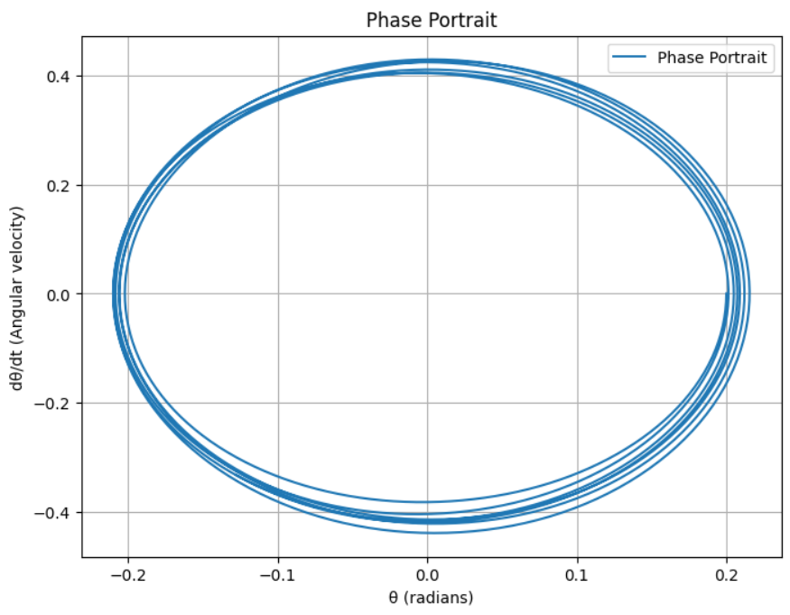

# Problem 2
# **Mathematical Analysis of the Forced Damped Pendulum**

## **1. Theoretical Foundation**
A forced damped pendulum represents a system under the influence of an external force while experiencing frictional damping.
The equation governing this system is:

$$
\frac{d^2theta}{dt^2} + beta \frac{dtheta}{dt} + \frac{g}{L} sintheta = A cos(omega t)
$$

Where:
- ( \theta ) : Angular position (in radians)
- ( \beta ) : Damping coefficient
- ( g ) : Gravitational acceleration
- ( L ) : Length of the pendulum
- ( A ) : Amplitude of the external forcing
- ( \omega ) : Angular frequency of the external force

### **Small-Angle Approximation**
If ( \theta ) is small, we can use the approximation ( \sin\theta \approx \theta ), reducing the equation to:

$$
\frac{d^2 theta}{dt^2} + beta \frac{d theta}{dt} + \frac{g}{L} theta = A cos(omega t)
$$

This linear differential equation can be analyzed using analytical methods.

## **2. Analysis of Dynamics**
To understand the system's behavior, we analyze the following factors:

- **Damping Coefficient (( \beta ))**: Determines how quickly oscillations diminish.
- **Driving Force (( A )) and Frequency ( \omega )**: Affect whether the system enters resonance or exhibits chaotic motion.
- **Phase Transitions and Chaos**: Under certain parameter values, the system may become chaotic.

## **3. Real-World Applications**
The forced damped pendulum model is applicable in various physical systems:
- **Energy Harvesting Devices**
- **Oscillations in Bridges and Buildings**
- **Electrical Circuits (e.g., RLC circuits)**
- **Biomechanics (Human Motion)**

## **4. Implementation: Python Simulation**
To observe the system's behavior over time, we can use Python to numerically solve the equations:

```python
import numpy as np
import matplotlib.pyplot as plt
from scipy.integrate import solve_ivp

# Parameters
g = 9.81  # Gravitational acceleration (m/s^2)
L = 1.0   # Pendulum length (m)
beta = 0.2  # Damping coefficient
A = 1.2  # Forcing amplitude
omega = 2.0  # Forcing frequency

def forced_damped_pendulum(t, y):
    theta, omega_dot = y
    dtheta_dt = omega_dot
    domega_dt = -beta * omega_dot - (g / L) * np.sin(theta) + A * np.cos(omega * t)
    return [dtheta_dt, domega_dt]

# Initial conditions
y0 = [0.2, 0.0]
t_span = (0, 20)
t_eval = np.linspace(t_span[0], t_span[1], 1000)

# Solve the equation
solution = solve_ivp(forced_damped_pendulum, t_span, y0, t_eval=t_eval)

# Plot results
plt.figure(figsize=(10, 5))
plt.plot(solution.t, solution.y[0], label='Angular Position (θ)')
plt.xlabel('Time (s)')
plt.ylabel('θ (radians)')
plt.title('Forced Damped Pendulum Motion')
plt.legend()
plt.grid()
plt.show()
```


## **5. Phase Portraits and Chaos Transitions**
To analyze chaotic behavior, we can visualize **phase portraits** (Poincaré sections). The following plot represents the phase space motion:

```python
plt.figure(figsize=(8, 6))
plt.plot(solution.y[0], solution.y[1], label='Phase Portrait')
plt.xlabel('θ (radians)')
plt.ylabel('dθ/dt (Angular velocity)')
plt.title('Phase Portrait')
plt.legend()
plt.grid()
plt.show()
```


## **6. Conclusions and Insights**
- **Higher damping** results in the system reaching equilibrium without oscillations.
- **Near resonance frequency**, large amplitude oscillations occur.
- **Increasing forcing amplitude** may lead to chaotic transitions.

This analysis provides a powerful model for applications in engineering and natural sciences. By using Markdown, we can document and explore the pendulum system’s dynamics in depth.
