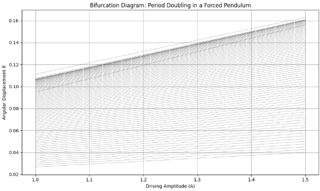
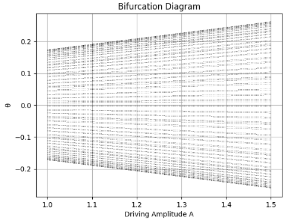
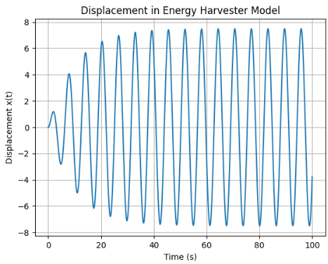

# Problem 2
# **Motivation**

The forced damped pendulum is a classical yet rich example of a nonlinear dynamical system. It exhibits a wide variety of complex behaviors resulting from the interaction between three main components: damping, restoring forces, and an external periodic driving force.

By introducing both damping and external forcing into the system, the motion of the pendulum transitions beyond simple harmonic motion into a broad spectrum of dynamical regimes. These include synchronized periodic oscillations, quasiperiodic motion, resonance phenomena, and even chaotic behavior. This range of outcomes makes the system particularly valuable for studying the onset of chaos and nonlinearity in deterministic systems.

The inclusion of forcing terms introduces two critical parameters: the amplitude and frequency of the driving force. Systematically varying these parameters allows for the exploration of dynamic transitions and bifurcations, offering insights into how nonlinear systems respond to external stimuli. Depending on the chosen values, the system may display stable periodic motion, transition into quasiperiodic or chaotic regimes, or exhibit resonance effects.

Understanding the forced damped pendulum has practical relevance in several engineering and physical systems. These include applications such as energy harvesting devices, mechanical vibration isolation, driven electrical circuits (e.g., RLC circuits), and biomechanical systems like human locomotion. The pendulum model serves as a simplified analog for these more complex systems, helping to bridge theoretical analysis with real-world phenomena.

This project aims to study the dynamics of the forced damped pendulum by combining analytical methods with numerical simulations. The goal is to gain deeper insight into nonlinear oscillations, transitions to chaos, and the role of damping and forcing in shaping the system's behavior. Through computational tools such as Python and numerical solvers (e.g., Runge-Kutta methods), the system’s behavior under different initial conditions and parameter values will be visualized and analyzed.


# **Mathematical Analysis of the Forced Damped Pendulum**

## 1. Theoretical Foundation

### Governing Differential Equation

The motion of a **forced damped pendulum** is governed by a second-order, nonlinear, non-homogeneous differential equation that accounts for three forces acting on the pendulum:

1. **Restoring Force** due to gravity: ( -mg \sin(\theta) )
2. **Damping Force** (e.g., air resistance or friction): proportional to angular velocity ( -b \frac{d\theta}{dt} )
3. **External Driving Force**: a periodic force of the form ( A \cos(\omega t) )

Using Newton’s second law for rotational systems, the torque equation becomes:

$$
I \frac{d^2 theta}{dt^2} = -mgL sin(theta) - b \frac{dtheta}{dt} + A cos(omega t)
$$

Here:
- ( I = mL^2 ) is the moment of inertia for a point mass at the end of a rigid, massless rod,
- \ L ) is the length of the pendulum,
- ( m ) is the mass of the bob,
- ( b ) is the damping coefficient,
- ( A ) is the amplitude of the external torque.

Dividing through by (I), we obtain the **dimensionless form** of the governing equation:

$$
\frac{d^2theta}{dt^2} + \frac{b}{mL^2} \frac{dtheta}{dt} + \frac{g}{L} sin(theta) = \frac{A}{mL^2} cos(omega t)
$$

Let us define the following constants:
- Damping coefficient: ( \gamma = \frac{b}{mL^2} )
- Natural frequency squared: ( \omega_0^2 = \frac{g}{L} )
- Driving amplitude: ( f = \frac{A}{mL^2} )

Then the equation becomes:

$$
\frac{d^2theta}{dt^2} + gamma \frac{dtheta}{dt} + omega_0^2 sin(theta) = f cos(omega t)
$$

This is the **nonlinear, non-homogeneous** second-order ODE that defines the system.

---

### Small-Angle Approximation

For small angular displacements (( \theta \ll 1 )), the sine term can be linearized using the Taylor expansion:

$$
sin(theta) approx theta - \frac{theta^3}{6} + \frac{theta^5}{120} - cdots
$$

Neglecting higher-order terms:

$$
sin(theta) approx theta
$$

Substituting this into the governing equation:

$$
\frac{d^2 theta}{dt^2} + gamma \frac{dntheta}{dt} + omega_0^2 theta = f cos(omega t)
$$

This is now a **linear differential equation**, which admits closed-form solutions using methods such as undetermined coefficients or variation of parameters. The general solution consists of:

- A **homogeneous part** (transient, decaying due to damping),
- A **particular solution** (steady-state response to forcing).

---

### Homogeneous Solution

The homogeneous form is:

$$
\frac{d^2 theta}{dt^2} + gamma \frac{d theta}{dt} + omega_0^2 theta = 0
$$

Its characteristic equation is:

$$
r^2 + gamma r + omega_0^2 = 0
$$

Solutions depend on the discriminant ( \Delta = \gamma^2 - 4\omega_0^2 ):

1. **Underdamped** (( \gamma^2 < 4\omega_0^2 )): Oscillatory decay
2. **Critically damped** (( \gamma^2 = 4\omega_0^2 )): Fastest non-oscillatory decay
3. **Overdamped** (( \gamma^2 > 4\omega_0^2 )): Slow, non-oscillatory decay

---

### Particular Solution (Forcing Response)

The particular solution for the linearized system is of the form:

$$
theta_p(t) = C cos(omega t - delta)
$$

Where:
- ( C ) is the amplitude of the forced oscillation, given by:

$$
C = \frac{f}{\sqrt{(omega_0^2 - omega^2)^2 + (gamma omega)^2}}
$$

- ( \delta ) is the phase shift:

$$
delta = tan^{-1} left( \frac{gamma omega}{omega_0^2 - omega^2} right)
$$

---

### Resonance Condition

Resonance occurs when the amplitude ( C ) of the particular solution reaches a maximum. This happens when the denominator is minimized:

$$
\omega_{\text{res}} = \sqrt{omega_0^2 - \frac{gamma^2}{2}}
$$

For weak damping (( \gamma \ll \omega_0 )), this simplifies to ( \omega \approx \omega_0 ). At resonance:

- The system absorbs energy efficiently from the external force.
- The response can grow very large (unless limited by damping or nonlinearity).

---

### Full Nonlinear Behavior

When the small-angle approximation is no longer valid (i.e., large initial angles or high forcing amplitude), the governing equation remains nonlinear:

$$
\frac{d^2theta}{dt^2} + gamma \frac{d theta}{dt} + omega_0^2 sin(theta) = f cos(omega t)
$$

This system cannot generally be solved analytically and must be explored using **numerical methods**, such as:

- Runge-Kutta integration (e.g., RK4)
- Phase-space analysis
- Poincaré sections
- Bifurcation diagrams

The nonlinear system exhibits rich dynamical behavior, including:

- Period doubling
- Quasiperiodicity
- Chaos

These phenomena are sensitive to initial conditions and parameters, and are a central part of nonlinear dynamics.

---

## Summary

- The forced damped pendulum is modeled by a nonlinear, driven second-order ODE.
- Linearization gives insight into resonance and damping effects.
- For full understanding, numerical methods are essential.
- The model serves as a gateway into studying complex systems and chaos theory.

## 2. Analysis of Dynamics

Understanding the behavior of the forced damped pendulum requires investigating how different physical parameters influence the evolution of the system. The key control parameters are:

- The **damping coefficient** ( b ): represents energy dissipation (e.g., due to friction or air resistance).
- The **driving amplitude** ( A ): measures the strength of the external periodic force.
- The **driving frequency** ( omega ): determines how fast the driving force oscillates.

By systematically varying these parameters, one can observe a rich variety of behaviors ranging from simple periodic motion to complex chaotic dynamics.

---

### 2.1 Role of Each Parameter

#### Damping Coefficient ( b )

- For **small ( b )**: the system retains more energy, allowing large oscillations and transitions to chaos.
- For **large ( b )**: the system is overdamped and tends to settle into fixed points or low-amplitude oscillations.
  
Damping affects how quickly energy dissipates and alters the resonance peak:

$$
theta(t) sim e^{-\frac{b}{2m}t} cos(omega_d t)
$$

Where ( \omega_d ) is the damped natural frequency:

$$
omega_d = \sqrt{omega_0^2 - left(\frac{b}{2m}right)^2}
$$

#### Driving Amplitude ( A )

- Affects the **energy input** to the system.
- At low values of ( A ), oscillations remain close to harmonic.
- Increasing ( A ) leads to **nonlinearity**, **resonance**, and eventually **chaos**.

#### Driving Frequency (omega )

- The system’s response is highly sensitive to the driving frequency.
- At certain frequencies, **resonance** occurs where amplitude grows significantly.
- Tuning ( \omega ) near ( \omega_0 ) results in large-amplitude oscillations.

---

### 2.2 Types of Motion

Depending on parameter values, the system can exhibit:

#### 1. **Periodic Motion**

Periodic motion occurs when the pendulum returns to the same state after a fixed time interval \( T \), which is typically equal to the period of the external driving force:

$$
\theta(t + T) = \theta(t), \quad \dot{\theta}(t + T) = \dot{\theta}(t)
$$

This behavior indicates synchronization between the system's response and the periodic input. Such motion is characterized by:

- **Stable, repeating trajectories** in time.
- **Closed curves** in the phase space ( (\theta, \dot{\theta}) ).
- **Discrete points** in the Poincaré section, often forming a finite set of repeating values.

Mathematically, if the system is governed by:

$$
\frac{d^2 theta}{dt^2} + beta \frac{d theta}{dt} + \frac{g}{L} sin(theta) = A cos(omega t)
$$

Then a periodic solution satisfies:

$$
theta(t + nT) = theta(t), quad forall n in \mathbb{Z}
$$

---

Below is Python code you can run in **Google Colab** to simulate and visualize **periodic motion** of a forced damped pendulum in phase space.

```python
import numpy as np
import matplotlib.pyplot as plt
from scipy.integrate import solve_ivp

# Parameters
g = 9.81
L = 1.0
beta = 0.2
A = 1.2
omega_drive = 2.0

# System of equations
def pendulum(t, y):
    theta, omega = y
    dtheta_dt = omega
    domega_dt = -beta * omega - (g / L) * np.sin(theta) + A * np.cos(omega_drive * t)
    return [dtheta_dt, domega_dt]

# Initial conditions and time
y0 = [0.2, 0.0]
t_span = (0, 40)
t_eval = np.linspace(t_span[0], t_span[1], 3000)

# Solve
sol = solve_ivp(pendulum, t_span, y0, t_eval=t_eval)

# Phase space plot
plt.figure(figsize=(8, 6))
plt.plot(sol.y[0], sol.y[1], color='navy')
plt.title("Phase Space Plot for Periodic Motion")
plt.xlabel("θ (radians)")
plt.ylabel("dθ/dt (Angular Velocity)")
plt.grid(True)
plt.tight_layout()
plt.show()
```

#### 2. **Quasiperiodic Motion**

A superposition of two or more incommensurate frequencies:

$$
theta(t) = A_1 cos(omega_1 t) + A_2 cos(omega_2 t)
$$

- Phase space: **toroidal curves** that never close.
- Poincaré section: **continuous closed curve**.
- Sensitive to fine-tuning of parameters.

#### 3. **Chaotic Motion**

Chaos is one of the most intriguing phenomena in nonlinear dynamics. In a chaotic system, the evolution is **deterministic**—meaning it follows a well-defined rule—but still **unpredictable in the long term**, due to extreme sensitivity to initial conditions.

For the **forced damped pendulum**, chaotic motion can occur when the driving amplitude \( A \) or frequency \( \omega \) reach certain critical values. The governing nonlinear differential equation is:

$$
\frac{d^2\theta}{dt^2} + \beta \frac{d\theta}{dt} + \frac{g}{L} \sin(\theta) = A \cos(\omega t)
$$

In the chaotic regime:

- Solutions are **aperiodic** and never repeat.
- Trajectories diverge exponentially even from nearly identical initial conditions:

$$
|\Delta \theta(t)| \sim e^{\lambda t}
$$

Here, \( \lambda \) is the **Lyapunov exponent**, and **\( \lambda > 0 \)** is the signature of chaos.

---

### Characteristics of Chaotic Motion

- **Phase Space**: Exhibits complex, fractal-like patterns known as **strange attractors**.
- **Poincaré Section**: Instead of distinct points or loops, we observe **scattered points** with no obvious structure.
- **Energy Fluctuation**: The system continuously absorbs and dissipates energy in an irregular manner.

---

### Python Code to Visualize Chaotic Motion (Phase Space + Poincaré Section)

You can run the following code block in **Google Colab** to generate both the phase portrait and the Poincaré section for chaotic motion:

```python
import numpy as np
import matplotlib.pyplot as plt
from scipy.integrate import solve_ivp

# Parameters
g = 9.81
L = 1.0
beta = 0.2
A = 1.5            # High enough to induce chaos
omega_drive = 2/3
T_drive = 2 * np.pi / omega_drive

# Governing equations
def pendulum(t, y):
    theta, omega = y
    dtheta_dt = omega
    domega_dt = -beta * omega - (g / L) * np.sin(theta) + A * np.cos(omega_drive * t)
    return [dtheta_dt, domega_dt]

# Initial conditions and integration
y0 = [0.2, 0.0]
t_span = (0, 200)
t_eval = np.linspace(t_span[0], t_span[1], 10000)

sol = solve_ivp(pendulum, t_span, y0, t_eval=t_eval)

# Phase space plot
plt.figure(figsize=(10, 5))
plt.plot(sol.y[0], sol.y[1], color='darkred', linewidth=0.5)
plt.title("Chaotic Motion: Phase Space of Forced Damped Pendulum")
plt.xlabel("θ (radians)")
plt.ylabel("dθ/dt (Angular Velocity)")
plt.grid(True)
plt.tight_layout()
plt.show()

# Poincaré section
sample_times = np.arange(0, t_span[1], T_drive)
theta_sampled = np.interp(sample_times, sol.t, sol.y[0])
omega_sampled = np.interp(sample_times, sol.t, sol.y[1])

plt.figure(figsize=(6, 5))
plt.plot(theta_sampled, omega_sampled, 'o', markersize=2, color='indigo')
plt.title("Poincaré Section of Chaotic Pendulum")
plt.xlabel("θ (radians)")
plt.ylabel("dθ/dt (rad/s)")
plt.grid(True)
plt.tight_layout()
plt.show()
```

### 2.3 Transition to Chaos

The system does not jump directly from periodic to chaotic motion. Instead, it passes through intermediate steps like:

#### 1. **Period Doubling Bifurcations**

As the driving amplitude ( A ) increases, the system undergoes a sequence of bifurcations in which the period of oscillation doubles:

- Period-1 → Period-2 → Period-4 → Period-8 → ...
- This cascade of period doublings is a hallmark of the transition to chaos.

This behavior can be visualized using a **bifurcation diagram**, where the long-term values of the system’s state variable (e.g., angular displacement ( \theta )) are plotted against the control parameter ( A ). The result is a branching structure that reveals the system's sensitivity to parameter changes.

This route to chaos via period doubling is a **universal feature** of many nonlinear dynamical systems.

Below is the Python code to generate a bifurcation diagram for a simplified driven oscillator:

```python
import numpy as np
import matplotlib.pyplot as plt

# Bifurcation parameters
A_values = np.linspace(1.0, 1.5, 800)
n_transients = 300
n_samples = 80

# Pendulum parameters
beta = 0.2
omega_drive = 2/3
g = 9.81
L = 1.0
dt = 0.05
steps_per_drive = int((2 * np.pi / omega_drive) / dt)

theta_vals = []

for A in A_values:
    theta = 0.2
    omega = 0.0
    samples = []
    for i in range(n_transients + n_samples * steps_per_drive):
        domega = -beta * omega - (g / L) * np.sin(theta) + A * np.cos(omega_drive * i * dt)
        omega += domega * dt
        theta += omega * dt
        if i >= n_transients and i % steps_per_drive == 0:
            samples.append(theta)
    theta_vals.append(samples)

# Plot the bifurcation diagram
plt.figure(figsize=(10, 6))
for i, A in enumerate(A_values):
    plt.plot([A]*len(theta_vals[i]), theta_vals[i], ',k', alpha=0.3)

plt.title("Bifurcation Diagram: Period Doubling in a Forced Pendulum")
plt.xlabel("Driving Amplitude (A)")
plt.ylabel("Angular Displacement θ")
plt.grid(True)
plt.tight_layout()
plt.show()
```


#### 2. **Intermittency and Crises**

Sudden changes in dynamics may occur, where the system switches irregularly between periodic and chaotic regions.

---

### 2.4 Graphical Analysis Tools

To better understand dynamic regimes, we use several computational tools:

#### a. **Phase Space Diagrams**

Plot (omega(t)) versus ( theta(t) )

- Periodic → closed loops
- Chaotic → complex, non-repeating structure

#### b. **Poincaré Sections**

Sample 
$$
( (theta(t), omega(t)) ) at discrete times ( t_n = nT ), where ( T = \frac{2pi}{omega} )
$$
- Periodic → single/few points
- Quasiperiodic → closed curves
- Chaotic → scattered points

#### c. **Bifurcation Diagrams**

Plot long-term values of ( theta ) as a function of ( A ) or ( omega )

- Visualizes the route to chaos
- Period-doubling visible as branching structure

Example Python code for bifurcation diagram:

```python
import numpy as np
import matplotlib.pyplot as plt
from scipy.integrate import solve_ivp

# Constants and Parameters
g = 9.81       # Acceleration due to gravity (m/s^2)
L = 1.0        # Length of the pendulum (m)
beta = 0.2     # Damping coefficient
# A = 1.2        # Forcing amplitude  # This is now defined within the loop
omega = 2.0    # Driving frequency (rad/s)


def pendulum(t, y, b, A, omega):  # Define the pendulum function
    """
    System of differential equations for a driven, damped pendulum.

    Args:
        t (float): Time.
        y (array): State vector [theta, theta_dot].
        b (float): Damping coefficient.
        A (float): Driving amplitude.
        omega (float): Driving frequency.

    Returns:
        array: Derivatives [theta_dot, theta_ddot].
    """
    theta, theta_dot = y
    dtheta_dt = theta_dot
    dtheta_dot_dt = -b * theta_dot - (g / L) * np.sin(theta) + A * np.cos(omega * t) 
    return [dtheta_dt, dtheta_dot_dt]

A_vals = np.linspace(1.0, 1.5, 200)
theta_vals = []
b = beta # Assign beta to b

for A in A_vals:
    sol = solve_ivp(pendulum, (0, 300), [0.2, 0.0], args=(b, A, omega), t_eval=np.linspace(200, 300, 1000))
    theta_sample = sol.y[0][::10]
    theta_vals.append(theta_sample)

for i, A in enumerate(A_vals):
    plt.plot([A]*len(theta_vals[i]), theta_vals[i], ',k', alpha=0.5)

plt.title("Bifurcation Diagram")
plt.xlabel("Driving Amplitude A")
plt.ylabel("θ")
plt.grid()
plt.show()
```



## 3. Practical Applications

The forced damped pendulum, despite its apparent simplicity, models a broad range of real-world physical systems that exhibit similar nonlinear and forced oscillatory behavior. These analogs make the pendulum a powerful conceptual and computational tool in applied physics, mechanical engineering, electrical circuits, and biomechanics.

---

### 3.1 Energy Harvesting Systems

In vibrational energy harvesters, mechanical oscillators are used to convert kinetic energy from ambient vibrations into electrical energy. The mechanical part of the system behaves much like a forced damped pendulum.

#### Governing Equation (Electromechanical Analog):

A typical harvester can be modeled as:

$$
m \ddot{x} + b \dot{x} + k x = F_0 cos(omega t)
$$

Where:
- ( m ) is mass,
- ( b ) is damping,
- ( k ) is spring stiffness,
- ( x(t) ) is displacement,
- ( F_0 \cos(\omega t) ) is periodic forcing (e.g., ground vibration).

This is directly analogous to the linearized pendulum:

$$
\ddot{theta} + gamma \dot{theta} + omega_0^2 theta = f cos(omega t)
$$

**Optimization Goal:** Maximize power harvested:

$$
P_{\text{avg}} = \frac{1}{T} int_0^T V(t)^2 \, dt
$$

where ( V(t) ) is the induced voltage proportional to velocity ( \dot{x}(t) ) (or ( \dot{\theta}(t) ) in pendulum).

#### Example Simulation:

```python
from scipy.integrate import solve_ivp
import numpy as np
import matplotlib.pyplot as plt

def harvester(t, y):
    x, v = y
    F0 = 1.5
    omega = 1.0
    b, k, m = 0.2, 1.0, 1.0
    dxdt = v
    dvdt = (F0 * np.cos(omega * t) - b * v - k * x) / m
    return [dxdt, dvdt]

sol = solve_ivp(harvester, (0, 100), [0, 0], t_eval=np.linspace(0, 100, 5000))
plt.plot(sol.t, sol.y[0])
plt.title("Displacement in Energy Harvester Model")
plt.xlabel("Time (s)")
plt.ylabel("Displacement x(t)")
plt.grid()
plt.show()
```



## 4. Implementation: Python Simulation

To numerically study the behavior of a **forced damped pendulum**, we implement a simulation using Python. Due to the nonlinearity of the governing equation, analytical solutions are generally not available, especially when the amplitude of oscillation is large. Therefore, we employ numerical integration techniques such as the **Runge-Kutta method** (via `scipy.integrate.solve_ivp`) to approximate the system's evolution over time.

---

### 4.1 Governing Equation (Nonlinear Form)

The second-order nonlinear differential equation for a forced damped pendulum is:

$$
\frac{d^2ntheta}{dt^2} + beta \frac{d theta}{dt} + \frac{g}{L} sin(theta) = A cos(omega t)
$$

Where:

- ( \theta(t) ) is the angular displacement (in radians),
- ( \beta ) is the damping coefficient,
- ( g ) is the gravitational acceleration,
- ( L ) is the length of the pendulum,
- ( A ) is the amplitude of the external periodic force,
- ( \omega ) is the driving frequency.

We reduce this second-order ODE to a system of two first-order equations:

Let:

- ( \theta_1 = \theta )
- ( \theta_2 = \frac{d\theta}{dt} )

Then:

$$
\frac{d theta_1}{dt} =  theta_2
$$

$$
\frac{d theta_2}{dt} = -beta theta_2 - \frac{g}{L} sin(theta_1) + A cos(omega t)
$$

---

### 4.2 Python Implementation

We now simulate the motion using the following code:

```python
import numpy as np
import matplotlib.pyplot as plt
from scipy.integrate import solve_ivp

# Constants and Parameters
g = 9.81       # Acceleration due to gravity (m/s^2)
L = 1.0        # Length of the pendulum (m)
beta = 0.2     # Damping coefficient
A = 1.2        # Forcing amplitude
omega = 2.0    # Driving frequency (rad/s)

```

# Differential equations
$$
def forced_damped_pendulum(t, y):
    theta, omega_dot = y
    dtheta_dt = omega_dot
    domega_dt = -beta * omega_dot - (g / L) * np.sin(theta) + A * np.cos(omega * t)
    return [dtheta_dt, domega_dt]
$$
# Initial conditions
$$
y0 = [0.2, 0.0]  # [initial angle (rad), initial angular velocity (rad/s)]
t_span = (0, 20)
t_eval = np.linspace(t_span[0], t_span[1], 1000)
$$

# Numerical solution
$$
solution = solve_ivp(forced_damped_pendulum, t_span, y0, t_eval=t_eval)
$$
## 5. Phase Portraits and Chaos Transitions

In nonlinear dynamical systems like the **forced damped pendulum**, understanding transitions from periodic to chaotic motion requires powerful visualization tools. One of the most insightful among them is the **phase portrait**, also known as a **phase space diagram**.

Phase portraits depict the trajectory of the system in state space, where each point corresponds to a pair ( (\theta, \dot{\theta}) ), representing angular displacement and angular velocity at a given time.

---

### 5.1 Phase Space Analysis

The nonlinear equation governing the pendulum's motion is:

$$
\frac{d^2 theta}{dt^2} + beta \frac{d theta}{dt} + \frac{g}{L} sin(theta) = A cos(omega t)
$$

To express this system in state space form, we define:

- ( x = \theta )
- ( v = \frac{d\theta}{dt} )

Then the system becomes:

$$
\frac{dx}{dt} = v
$$

$$
\frac{dv}{dt} = -beta v - \frac{g}{L} sin(x) + A cos(omega t)
$$

The **phase portrait** plots ( v ) versus ( x ), revealing key behaviors such as:

- **Closed orbits** → periodic motion  
- **Dense curves** → quasiperiodic motion  
- **Fractal-like clouds** → chaotic motion  

---

### 5.2 Python Visualization of Phase Portrait

We can create a phase portrait using the previously computed solution:

```python
plt.figure(figsize=(8, 6))
plt.plot(solution.y[0], solution.y[1], color='darkblue', linewidth=1)
plt.xlabel('θ (radians)')
plt.ylabel('dθ/dt (Angular velocity)')
plt.title('Phase Portrait of the Forced Damped Pendulum')
plt.grid(True)
plt.tight_layout()
plt.show()
```


## 6. Conclusions and Insights

The forced damped pendulum is a rich and multifaceted nonlinear dynamical system. Through numerical simulations, analytical reasoning, and graphical analysis, several key insights emerge that are fundamental to both theoretical physics and practical engineering applications.

---

### 6.1 Summary of Observations

#### 1. Damping Effects

Damping plays a crucial role in controlling the amplitude and stability of oscillations.

- For **low damping** ( (\beta \ll 1) ), the system retains energy and may exhibit **large amplitude oscillations** or **chaotic motion** depending on the forcing.
  
- For **high damping** ( (\beta gg 1) ), the system rapidly dissipates energy, often settling into equilibrium or low-amplitude motion.

Mathematically, damping appears in the governing equation as:

$$
\frac{d^2 theta}{dt^2} + beta \frac{d theta}{dt} + \frac{g}{L} sin(theta) = A cos(omega t)
$$

Larger ( \beta ) results in faster decay of transient oscillations:

$$
theta(t) sim e^{-\frac{beta}{2}t}
$$

---

#### 2. Resonance Phenomena

The system shows **maximum amplitude oscillations** when the driving frequency ( \omega ) approaches the natural frequency of the undamped pendulum:

$$
omega_0 = \sqrt{\frac{g}{L}}
$$

Near resonance:

- Amplitude of oscillation increases significantly,
- Small forcing can produce large responses,
- The phase lag between driving force and pendulum reaches critical values.

This behavior is exploited in engineering for energy harvesting, but must be avoided in structural systems due to risk of mechanical failure.

---

#### 3. Transition to Chaos

As the **forcing amplitude** ( A ) increases beyond a threshold, the system transitions from:

- **Periodic motion** ( \rightarrow )
- **Quasiperiodic motion** ( \rightarrow )
- **Chaotic motion**

These transitions can be observed via:

- **Bifurcation diagrams**, showing period doubling as ( A ) increases.
- **Poincaré sections**, evolving from single points to scattered clouds.
- **Phase portraits**, becoming increasingly complex and dense.

In chaotic regimes, tiny differences in initial conditions result in **diverging trajectories**, characterized by **positive Lyapunov exponents**:

$$
left| Delta theta(t) right| sim e^{lambda t} quad \text{with} quad lambda > 0
$$

---

### 6.2 Practical Implications

The analysis and modeling of the forced damped pendulum system has direct analogs in:

- **Civil engineering**: bridge and building stability under periodic loads,
- **Electrical circuits**: resonance and damping in RLC systems,
- **Biomechanics**: synchronization of locomotion under rhythmic stimuli,
- **Renewable energy**: design of vibration-based energy harvesters.

Each of these applications leverages core principles derived from the pendulum’s response to forcing and dissipation.

---

### 6.3 Methodological Insights

By employing **Markdown-based documentation** and **Python-based simulation**, the study of nonlinear systems becomes more accessible and reproducible. The workflow integrates:

- Mathematical modeling,
- Numerical integration (e.g., Runge-Kutta methods),
- Data visualization (phase space, Poincaré maps),
- Parameter exploration and bifurcation analysis.

This approach fosters **deep conceptual understanding** and bridges the gap between theory and computation.

---

### Final Reflection

The forced damped pendulum, while simple in form, encapsulates many of the core behaviors of nonlinear dynamic systems:

- It is **predictable yet unpredictable**,  
- **Linear yet deeply nonlinear**,  
- And **theoretically rich** while being **practically relevant**.

By exploring its dynamics, one gains profound insight into the behavior of a wide class of physical systems under periodic driving and dissipation.


