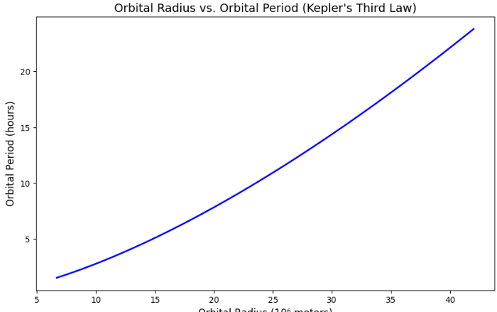
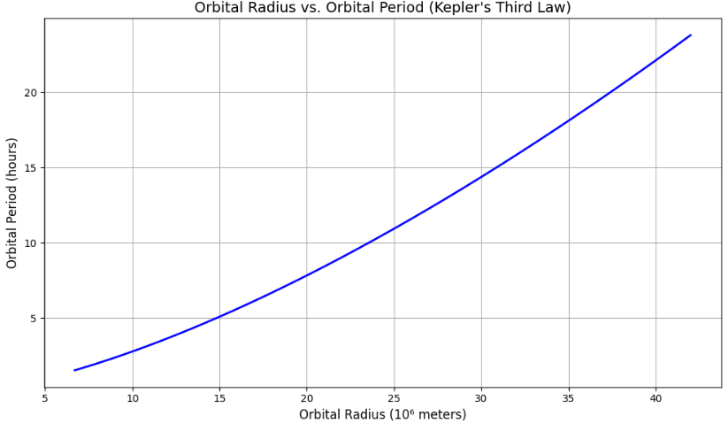
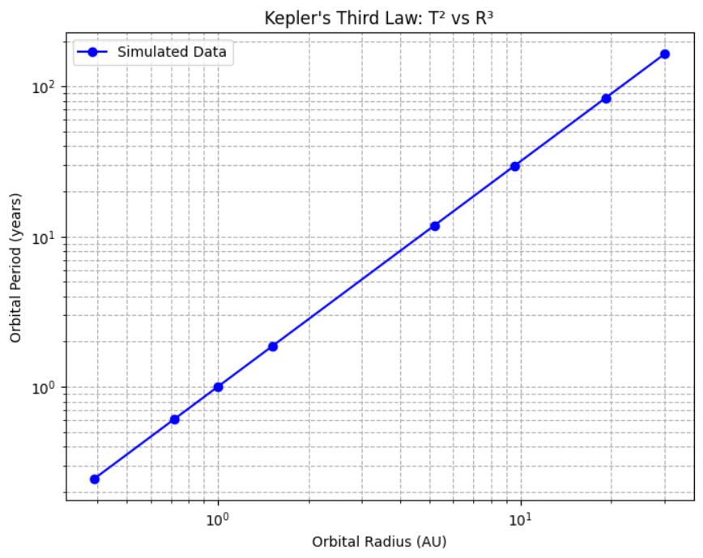
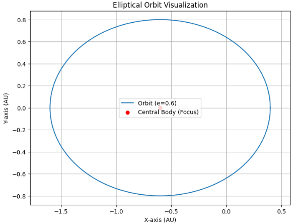

# Problem 
# **Deriving Kepler's Third Law for Circular Orbits**

## 1. Theoretical Foundation

Kepler's Third Law, also known as the Law of Harmonies, describes a fundamental relationship between the orbital period of a planet (or any object orbiting a central body) and its orbital radius. The law states:

$$
T^2 \propto R^3
$$

This indicates that the square of the orbital period (T) is directly proportional to the cube of the orbital radius (R).

### Derivation from Newtonian Mechanics

To understand this law in detail, we start with Newton's Law of Universal Gravitation and principles of circular motion dynamics.

**Newton's Law of Universal Gravitation** is expressed as:

$$
F = \frac{GMm}{R^2}
$$

Where:

- (F) is the gravitational force between two bodies,
- (G) is the gravitational constant ((6.67430 \times 10^{-11}\,\text{m}^3\,\text{kg}^{-1}\,\text{s}^{-2})),
- (M) is the mass of the central object (e.g., the Sun),
- (R) is the distance between the centers of the two objects (orbital radius).

### Circular Orbit Dynamics

For an object in a stable circular orbit, the gravitational force provides the centripetal force necessary for circular motion. The centripetal force (F_c) needed to keep an object in circular motion is given by:

$$
F_c = \frac{mv^2}{R}
$$

where:

- (m) is the mass of the orbiting object,
- (v) is the orbital velocity,
- (R) is the orbital radius.

### Equating Gravitational and Centripetal Forces

Since the gravitational force provides the required centripetal force, we set the two forces equal:

$$
\frac{GMm}{R^2} = \frac{mv^2}{R}
$$

Simplifying by canceling (m) (assuming (m \ll M)) and one (R):

$$
\frac{GM}{R} = v^2
$$

### Expressing Velocity in Terms of Orbital Period

The orbital velocity (v) can also be expressed in terms of the orbital period (T). Since the circumference of the orbit is (2\pi R), and the object completes this distance in one orbital period (T), we have:

$$
v = \frac{2\pi R}{T}
$$

Substituting this into the previous equation:

$$
\frac{GM}{R} = \left(\frac{2\pi R}{T}\right)^2
$$

Simplifying further gives:

$$
\frac{GM}{R} = \frac{4\pi^2 R^2}{T^2}
$$

Multiplying both sides by (T^2) and rearranging, we obtain:

$$
T^2 = \frac{4\pi^2}{GM} R^3
$$

### Final Relation (Kepler's Third Law)

Thus, we derive the exact form of Kepler’s Third Law:

$$
T^2 \propto R^3
$$

or explicitly as:

$$
T^2 = \frac{4\pi^2}{GM} R^3
$$

### Example Application

For example, to calculate the orbital period of a satellite orbiting the Earth at a certain altitude, substitute the values of (G), (M) (mass of Earth (5.972 \times 10^{24}\,\text{kg})), and the orbital radius (R) into the formula above.

This derivation clearly illustrates the fundamental physical principles underlying Kepler's Third Law.

### **Newton's Law of Gravitation**
The gravitational force between two masses ( M ) and ( m ) is given by:

$$
F = \frac{G M m}{R^2}
$$

where:
- ( G ) is the gravitational constant,
- ( R ) is the orbital radius.

For a circular orbit, the gravitational force provides the necessary centripetal force:

$$
\frac{G M m}{R^2} = m \frac{v^2}{R}
$$

Canceling ( m ) and solving for orbital velocity ( v ):

$$
v^2 = \frac{G M}{R}
$$

Using the relation between velocity and period $$(( v = \frac{2\pi R}{T} ))$$:

$$
left(\frac{2pi R}{T}right)^2 = \frac{G M}{R}
$$

Rearranging:

$$
T^2 = \frac{4 pi^2}{G M} R^3
$$

Thus, we confirm that 
$$
( T^2 \propto R^3 ).
$$

## **2. Implications for Astronomy**

Kepler's Third Law is extensively used in astronomy and astrophysics, serving as a fundamental tool in understanding celestial phenomena. It helps astronomers analyze various aspects of planetary and stellar systems, and is crucial in both observational and theoretical astronomy.

### **Estimation of Planetary and Stellar Masses**

Astronomers frequently use Kepler's Third Law to estimate the mass of celestial bodies. When the orbital period and orbital radius of a planet or a satellite orbiting a central celestial body (like a star or planet) are known, the mass of the central object can be directly calculated. Rearranging Kepler's equation:

$$
M = \frac{4\pi^2 R^3}{G T^2}
$$

By accurately measuring orbital periods (T) and distances (R), astronomers can determine masses of planets, stars, and even distant galaxies, improving our understanding of celestial bodies and their interactions.

### **Determination of Astronomical Distances**

Kepler's Third Law also helps determine astronomical distances. If the orbital period of an object around a central body of known mass is measured, the orbital radius can be calculated precisely:

$$
R = \sqrt[3]{\frac{G M T^2}{4 \pi^2}}
$$

This method is used for objects in our Solar System and beyond, such as distant exoplanets orbiting other stars. By carefully measuring the orbital period of exoplanets, astronomers can infer their distances from their host stars, significantly aiding the mapping of exoplanetary systems.

### **Prediction and Analysis of Satellite Orbits**

Satellite technology heavily relies on Kepler's Third Law. Engineers and mission planners use it to design stable orbits for satellites and spacecraft. Whether deploying communication satellites, weather satellites, or global positioning systems (GPS), precise calculations using Kepler's Third Law ensure satellites remain in stable and predictable orbits. 

For instance, geostationary satellites, crucial for telecommunications, must have an orbital period matching Earth's rotation period (24 hours), and their orbital radius can be directly calculated using the law:

$$
R = \sqrt[3]{\frac{G M_{\text{Earth}} T^2}{4 \pi^2}}
$$

### **Study and Detection of Exoplanets**

Kepler's Third Law is fundamental to the discovery and analysis of exoplanets—planets orbiting other stars. The transit and radial velocity methods, two common methods for detecting exoplanets, rely on accurately interpreting periodic signals. Once orbital periods are known from these periodic signals, astronomers calculate orbital radii and gain insight into the exoplanets' environments, potentials for habitability, and orbital dynamics.

```python
import numpy as np
import matplotlib.pyplot as plt

# Constants
G = 6.67430e-11       # Gravitational constant (m^3 kg^-1 s^-2)
M = 5.972e24          # Mass of Earth (kg)

# Define a range for orbital radius (from low Earth orbit to geostationary orbit)
radius = np.linspace(6.7e6, 4.2e7, 1000)  # in meters

# Calculate orbital period using Kepler's Third Law
T = 2 * np.pi * np.sqrt(radius**3 / (G * M))

# Convert period from seconds to hours for readability
T_hours = T / 3600  

# Plotting
plt.figure(figsize=(10, 6))
plt.plot(radius / 1e6, T_hours, linewidth=2, color='blue')
plt.title("Orbital Radius vs. Orbital Period (Kepler's Third Law)", fontsize=14)
plt.xlabel("Orbital Radius (10⁶ meters)", fontsize=12)
plt.ylabel("Orbital Period (hours)", fontsize=12)
plt.grid(True)
plt.tight_layout()
plt.show()
```




# Orbital Period and Radius: Real-World Examples and Analysis

Kepler's Third Law provides a practical way to analyze celestial motion. Here we detail some important real-world examples, complete with equations, calculations, and Python simulations.

## Kepler’s Third Law

Kepler's third law relates the orbital period ( T ) and the orbital radius ( r ) as follows:

$$
T^2 = \frac{4\pi^2}{GM} r^3
$$

- ( T ): Orbital period (seconds)
- ( r ): Orbital radius or semi-major axis (meters)
- ( G ): Universal gravitational constant (6.67430 \times 10^{-11} \, \text{m}^3 \text{kg}^{-1}\text{s}^{-2})
- ( M ): Mass of the central body (kg)

## Real-World Examples

### 1. Moon’s Orbit Around Earth

The Moon orbits the Earth approximately every 27.3 days.

Convert the orbital period (T) to seconds:

$$
T = 27.3 \text{ days} \times 24 \frac{\text{hours}}{\text{day}} \times 3600 \frac{\text{seconds}}{\text{hour}} \approx 2.36 \times 10^6 \text{ s}
$$

Average orbital radius of the Moon around Earth is approximately:

$$
r = 3.84 \times 10^8 \text{ m}
$$

Rearranging Kepler’s Law to estimate Earth’s mass:

$$
M = \frac{4\pi^2 r^3}{G T^2}
$$

#### Python Simulation and Calculation

```python
import numpy as np

# Constants
G = 6.67430e-11  # gravitational constant, m^3 kg^-1 s^-2
r = 3.84e8       # orbital radius of the moon, meters
T = 27.3 * 24 * 3600  # orbital period, seconds

# Calculating Earth's mass
M_earth = (4 * np.pi**2 * r**3) / (G * T**2)
print(f"Estimated Mass of Earth: {M_earth:.2e} kg")
```

## **4. Python Simulation**
To verify the relationship, we simulate circular orbits.

```python
import numpy as np
import matplotlib.pyplot as plt

# Constants
G = 6.67430e-11  # Gravitational constant (m^3 kg^-1 s^-2)
M = 1.989e30  # Mass of the Sun (kg)

# Define orbital radii (in AU, converted to meters)
au = 1.496e11  # 1 Astronomical Unit in meters
radii = np.array([0.39, 0.72, 1.0, 1.52, 5.2, 9.58, 19.18, 30.07]) * au

# Compute periods using Kepler's Third Law
periods = np.sqrt((4 * np.pi**2 * radii**3) / (G * M))

# Convert periods to years
periods_years = periods / (60 * 60 * 24 * 365)

# Plot
plt.figure(figsize=(8,6))
plt.loglog(radii/au, periods_years, 'bo-', label='Simulated Data')
plt.xlabel('Orbital Radius (AU)')
plt.ylabel('Orbital Period (years)')
plt.title("Kepler's Third Law: T² vs R³")
plt.legend()
plt.grid(True, which='both', linestyle='--')
plt.show()
```



## **5. Extending to Elliptical Orbits**

While we've primarily discussed circular orbits, **Kepler's Third Law** equally applies to **elliptical orbits**. Instead of a simple orbital radius, elliptical orbits are characterized by their **semi-major axis** (a), the longest radius of the ellipse.

### **Kepler’s Third Law for Elliptical Orbits**

For elliptical orbits, Kepler's third law is expressed by replacing the orbital radius (r) with the semi-major axis (a):

$$
T^2 = \frac{4\pi^2}{GM}a^3
$$

- (T): Orbital period of the orbiting body.
- (a): Semi-major axis of the elliptical orbit.
- (G): Universal gravitational constant.
- (M): Mass of the central celestial body.

### **Elliptical Orbit Parameters**

An elliptical orbit has several key parameters:

- **Semi-major axis (a)**: Half the length of the ellipse’s longest diameter.
- **Semi-minor axis (b)**: Half the shortest diameter.
- **Eccentricity (e)**: Defines the ellipse's shape. For circular orbits, (e=0). Higher eccentricity means a more elongated orbit.
  
These parameters relate through the equation:

$$
b = a\sqrt{1 - e^2}
$$

### **Real-World Example: Halley’s Comet**

Halley's Comet has a notably elliptical orbit around the Sun:

| Parameter                | Value                          |
|--------------------------|--------------------------------|
| Orbital Period ((T))   | ~75.3 years                    |
| Semi-major axis ((a))  | (2.667 \times 10^{12}) m (~17.8 AU) |
| Eccentricity ((e))     | 0.967                          |

Convert the orbital period (T) to seconds:

$$
T = 75.3 \text{ years} \times 365.25 \text{ days/year} \times 24 \text{ hr/day} \times 3600 \text{ s/hr} \approx 2.38 \times 10^{9} \text{ s}
$$

Verify Kepler's third law to estimate the mass of the Sun (M):

$$
M = \frac{4\pi^2 a^3}{G T^2}
$$

#### **Python Calculation**

```python
import numpy as np

# Constants
G = 6.67430e-11  # gravitational constant, m³ kg⁻¹ s⁻²
a = 2.667e12     # semi-major axis in meters
T = 75.3 * 365.25 * 24 * 3600  # period in seconds

# Calculating Sun's mass using Halley's Comet data
M_sun = (4 * np.pi**2 * a**3) / (G * T**2)
print(f"Estimated Mass of the Sun: {M_sun:.2e} kg")
```
```python
import matplotlib.pyplot as plt
import numpy as np

# Ellipse parameters
a = 1.0  # Semi-major axis
e = 0.6  # Eccentricity
b = a * np.sqrt(1 - e**2)

# Parameterizing the ellipse
theta = np.linspace(0, 2 * np.pi, 1000)
x = a * np.cos(theta) - a * e  # shifted to the focus point
y = b * np.sin(theta)

# Plotting the elliptical orbit
plt.figure(figsize=(8, 6))
plt.plot(x, y, label=f'Orbit (e={e})')
plt.scatter(-a * e, 0, color='red', marker='o', label='Central Body (Focus)')
plt.title('Elliptical Orbit Visualization')
plt.xlabel('X-axis (AU)')
plt.ylabel('Y-axis (AU)')
plt.grid(True)
plt.axis('equal')
plt.legend()
plt.show()
```

## **6. Conclusion**

**Kepler’s Third Law** plays a fundamental role in celestial mechanics and astrophysics, establishing a crucial mathematical relationship between orbital periods and orbital distances. Initially discovered through careful astronomical observations by Johannes Kepler, this law provides strong observational evidence supporting Newton’s universal law of gravitation.

### **Observational Verification and Implications**

Through rigorous astronomical observations and modern computational analyses, Kepler's law has been repeatedly confirmed for celestial bodies within the Solar System and beyond. These confirmations not only validate classical Newtonian gravitational theory but also provide a robust basis for precision calculations in modern astrodynamics, orbital mechanics, and space exploration.

### **Applications in Modern Astronomy and Astrophysics**

Kepler’s third law has profound implications in the study of exoplanetary systems. It enables astronomers to:

- **Detect and characterize exoplanets**, determining their orbital periods, distances from host stars, and mass distributions.
- Perform precise orbital maneuvers for interplanetary spacecraft, including missions utilizing elliptical transfer orbits (e.g., Hohmann transfers).
- Accurately predict comet and asteroid trajectories, aiding planetary defense initiatives and space missions.

### **Expanding Beyond the Solar System** 

The applicability of Kepler’s law extends far beyond our Solar System, serving as a cornerstone in astrophysics for analyzing binary star systems, black hole accretion disks, and galaxy rotation dynamics. Moreover, advancements in observational astronomy—such as space-based telescopes (Kepler, TESS, JWST)—continue to leverage this foundational law to deepen our understanding of distant worlds and astrophysical phenomena.

### **Future Perspectives**

With advancements in observational technology and computational methods, Kepler’s third law remains indispensable. Its continued relevance in modern astrophysics emphasizes not only historical scientific progress but also guides future research directions, including:

- **Refined modeling of gravitational interactions** within star systems.
- Improved predictive models for planetary formation and evolution.
- Enhanced strategies for spacecraft navigation and long-term mission planning.

Thus, **Kepler’s Third Law** stands as a timeless principle, bridging historical astronomy and cutting-edge astrophysical research, continually deepening our comprehension of the universe.

--- 
