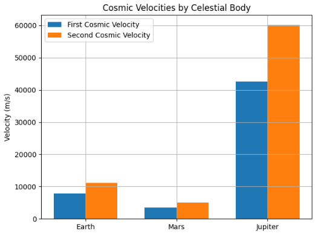

# Problem 
# Escape Velocities and Cosmic Velocities

## Motivation

Understanding cosmic velocities—such as orbital speed and escape velocity—is fundamental in astrophysics and aerospace engineering. These critical speed thresholds determine whether a spacecraft can stay in orbit, escape a planet’s gravity, or even leave an entire star system.

The first cosmic velocity is the minimum speed needed for a satellite to maintain a stable circular orbit near a planet’s surface. It’s essential for deploying communication, weather, and observation satellites. The second cosmic velocity, or escape velocity, allows a spacecraft to break free from Earth’s gravitational pull—vital for Moon, Mars, and deep-space missions. The third cosmic velocity goes further, representing the speed required to exit a planetary system entirely, relevant to interstellar probes like Voyager 1 and 2.

These velocities are not just theoretical—they directly influence spacecraft design, fuel requirements, and mission planning. Every kilogram of mass and every meter per second of velocity impacts cost, complexity, and mission success.

Cosmic velocities are rooted in Newtonian mechanics, energy conservation, and angular momentum. They are essential in simulations, orbital transfers, and trajectory planning, widely used by organizations like NASA, ESA, SpaceX, and Blue Origin.

Beyond engineering, these concepts symbolize humanity’s drive to explore. Achieving escape velocity is both a technical milestone and a powerful metaphor for breaking boundaries and venturing into the unknown.

As we enter a new era of space exploration—colonizing Mars, mining asteroids, and exploring the outer solar system—understanding these cosmic speed limits is more crucial than ever. They are no longer just numbers; they are the stepping stones to humanity’s future among the stars.

---

## 1. Definitions of Cosmic Velocities

### 1.1 First Cosmic Velocity (Orbital Velocity)

The **first cosmic velocity**, also called **orbital velocity**, is the minimum horizontal speed an object must have to maintain a stable **circular orbit** just above the surface of a planet—without any further propulsion. At this speed, the object is constantly "falling" toward the planet due to gravity, but its forward motion causes it to continuously miss the surface, resulting in a stable orbit.

---

####  Formula:

$$
v_1 = \sqrt{\frac{GM}{R}}
$$

Where:
- ( v_1 ) = first cosmic velocity (m/s)
- ( G ) = gravitational constant $$( = 6.67430 \times 10^{-11} \, \text{m}^3/\text{kg} \cdot \text{s}^2 )$$
- ( M ) = mass of the planet (kg)
- ( R ) = radius of the planet (m), measured from the center to the object in orbit

---

####  Derivation:

This formula is derived by equating the **gravitational force** acting on an object to the **centripetal force** needed to maintain circular motion:

$$
\frac{G M m}{R^2} = \frac{m v^2}{R}
$$

Cancelling ( m ) and solving for ( v ):

$$
v = \sqrt{\frac{GM}{R}}
$$

This shows that the orbital velocity depends **only on the mass and radius of the planet**, not on the orbiting object's mass.

---

####  Example: Orbit Around Earth

Let’s calculate the first cosmic velocity near Earth's surface.

**Given:**
- $$ ( G = 6.67430 \times 10^{-11} \, \text{m}^3/\text{kg} \cdot \text{s}^2 ) $$
- $$ ( M = 5.972 \times 10^{24} \, \text{kg} ) $$
- $$ ( R = 6.371 \times 10^6 \, \text{m} ) $$

**Calculation:**

$$
v_1 = \sqrt{\frac{(6.67430 \times 10^{-11}) \cdot (5.972 \times 10^{24})}{6.371 \times 10^6}} \approx 7,905 \, \text{m/s}
$$

So, the minimum speed to orbit the Earth just above its surface is approximately **7.9 km/s** (or **28,440 km/h**).

---

####  Real-World Applications

- **Satellite Launches:** Most low-Earth orbit (LEO) satellites are launched to reach or exceed this velocity.
- **International Space Station (ISS):** Orbits Earth at roughly 7.66 km/s.
- **Space Missions:** Used to determine the speed necessary for stable orbital insertion.

---

####  Comparison with Other Cosmic Velocities

| Velocity Type         | Description                                  | Speed (Earth)  |
|-----------------------|----------------------------------------------|----------------|
| First Cosmic Velocity | Orbit just above surface                     | ~7.9 km/s      |
| Second Cosmic Velocity| Escape from Earth’s gravitational field      | ~11.2 km/s     |
| Third Cosmic Velocity | Escape from Solar System                     | ~16.6 km/s     |

---

#### Notes

- The formula assumes:
  - A **spherical, non-rotating planet**
  - **No atmospheric resistance**
  - A **circular** orbit very close to the planet’s surface
- In real-world scenarios:
  - **Atmospheric drag** makes it impractical to orbit right above the surface, so most satellites orbit hundreds of kilometers above.
  - The actual required speed is slightly lower at higher altitudes due to increased orbital radius \( R \).

---

The first cosmic velocity is a cornerstone in orbital mechanics and space mission design. Mastery of this concept is essential for anyone working in astrophysics, aerospace engineering, or satellite technology.


---

### 1.2 Second Cosmic Velocity (Escape Velocity)

The **second cosmic velocity** is the minimum velocity required for an object to escape the gravitational field of a celestial body without further propulsion.

**Formula:**
$$
v_2 = \sqrt{\frac{2GM}{R}} = \sqrt{2} \cdot v_1
$$

---

### 1.3 Third Cosmic Velocity (Solar System Escape)

The **third cosmic velocity** is the velocity required to escape not just a planet, but the gravitational influence of the star it orbits (e.g., escaping the Sun's gravity from Earth).

**Formula:**
Approximated using conservation of energy:
$$
v_3 = \sqrt{v_{e,planet}^2 + v_{orbit,planet}^2}
$$

Where:
- ( v_{e,planet} ) is the escape velocity from the planet
- ( v_{orbit,planet} ) is the orbital speed of the planet around the Sun

---

## 2. Derivation of Formulas

Understanding how the formulas for **escape velocity** and **orbital velocity** are derived helps build a strong foundation in classical mechanics and gravitational physics. Both derivations are rooted in Newton’s laws and energy principles.

---

### 2.1 Deriving Escape Velocity

**Escape velocity** is the minimum speed an object must have to break free from a planet’s gravitational field **without any further propulsion**. To derive this, we apply the **conservation of mechanical energy** principle.

An object escaping a planet's gravity moves from radius ( R ) (near the planet's surface) to an infinite distance $( R \to \infty )$, where both potential and kinetic energy become zero.

#### Total mechanical energy:
- **Initial energy** at radius ( R ):  
  - Kinetic: $( \frac{1}{2}mv^2 )$  
  - Potential: $( -\frac{GMm}{R} )$  
- **Final energy** at $( R \to \infty )$:  
  - Kinetic = 0  
  - Potential = 0

Applying conservation of energy:

$$
\frac{1}{2}mv^2 - \frac{GMm}{R} = 0
$$

Solving for ( v ) (escape velocity):

$$
\frac{1}{2}mv^2 = \frac{GMm}{R}
$$

Cancel mass ( m\):

$$
\frac{1}{2}v^2 = \frac{GM}{R}
$$

Multiply both sides by 2:

$$
v^2 = \frac{2GM}{R}
$$

Final result:

$$
v = \sqrt{\frac{2GM}{R}}
$$

This is the **second cosmic velocity**, or **escape velocity**, which depends only on the mass and radius of the planet.

---

### 2.2 Deriving Orbital Velocity

**Orbital velocity** is the minimum speed required for an object to maintain a stable **circular orbit** at radius ( R ) from the center of a planet. To derive this, we equate the gravitational force to the **centripetal force** needed to keep the object in circular motion.

####  Forces involved:
- Gravitational force:
  $$
  F_g = \frac{GMm}{R^2}
  $$
- Centripetal force:
  $$
  F_c = \frac{mv^2}{R}
  $$

Set them equal:

$$
\frac{GMm}{R^2} = \frac{mv^2}{R}
$$

Cancel mass ( m ) from both sides:

$$
\frac{GM}{R^2} = \frac{v^2}{R}
$$

Multiply both sides by ( R ):

$$
\frac{GM}{R} = v^2
$$

Solve for ( v ):

$$
v = \sqrt{\frac{GM}{R}}
$$

This is the **first cosmic velocity**, or **orbital velocity**, required to maintain a stable circular orbit at radius ( R ).

---

### 📝 Summary of Formulas

| Quantity            | Formula                            | Description                              |
|---------------------|-------------------------------------|------------------------------------------|
| Orbital Velocity     | $$( v = \sqrt{\frac{GM}{R}} )$$       | Speed to stay in a circular orbit        |
| Escape Velocity      | $$( v = \sqrt{\frac{2GM}{R}} )$$      | Speed to escape gravity completely       |

These derivations show the deep connection between energy, force, and motion in gravitational systems.

---

## 3. Python Simulation Code (Run in Google Colab)

```python

import matplotlib.pyplot as plt
import numpy as np

G = 6.67430e-11  # gravitational constant

# Celestial bodies
bodies = {
    'Earth': {'mass': 5.972e24, 'radius': 6.371e6},
    'Mars': {'mass': 6.4171e23, 'radius': 3.3895e6},
    'Jupiter': {'mass': 1.898e27, 'radius': 6.9911e7},
}

# Velocity calculations
def calculate_velocities(mass, radius):
    v1 = np.sqrt(G * mass / radius)
    v2 = np.sqrt(2 * G * mass / radius)
    return v1, v2

# Plotting
labels = []
v1_vals = []
v2_vals = []

for body, data in bodies.items():
    v1, v2 = calculate_velocities(data['mass'], data['radius'])
    labels.append(body)
    v1_vals.append(v1)
    v2_vals.append(v2)

x = np.arange(len(labels))
width = 0.35

fig, ax = plt.subplots()
ax.bar(x - width/2, v1_vals, width, label='First Cosmic Velocity')
ax.bar(x + width/2, v2_vals, width, label='Second Cosmic Velocity')

ax.set_ylabel('Velocity (m/s)')
ax.set_title('Cosmic Velocities by Celestial Body')
ax.set_xticks(x)
ax.set_xticklabels(labels)
ax.legend()
plt.grid(True)
plt.tight_layout()
plt.show()
```


---

## 4. Calculated Examples

The values below show approximate **first (orbital)** and **second (escape)** cosmic velocities for different planets. These speeds are calculated using the formulas:

- $$( v_1 = \sqrt{\frac{GM}{R}} )$$
- $$( v_2 = \sqrt{\frac{2GM}{R}} )$$

They provide insight into how planetary mass and radius affect the required velocities for orbit and escape.

### Earth:
- Mass = $$( 5.972 \times 10^{24} \, \text{kg} )$$
- Radius = $$( 6.371 \times 10^6 \, \text{m} )$$
- $$( v_1 \approx 7.91 \, \text{km/s} )$$
- $$( v_2 \approx 11.2 \, \text{km/s} )$$

### Mars:
- $$( v_1 \approx 3.56 \, \text{km/s} )$$
- $$( v_2 \approx 5.03 \, \text{km/s} )$$

### Jupiter:
- $$( v_1 \approx 42.1 \, \text{km/s} )$$
- $$( v_2 \approx 59.5 \, \text{km/s} )$$

---

These examples highlight how **larger and denser planets** require significantly higher velocities for both orbiting and escaping. For instance, Jupiter’s enormous mass leads to much higher orbital and escape velocities compared to Earth or Mars.

Such calculations are crucial in **mission planning**, as they directly impact rocket design, fuel consumption, and trajectory optimization for interplanetary travel.


## 5. Applications in Space Exploration

Cosmic velocities are not just theoretical constructs; they play a vital role in the **design, execution, and success** of real-world space missions. From placing satellites into orbit to sending probes beyond our solar system, understanding these velocity thresholds is essential for space engineers and scientists.

---

### 5.1 Satellites

- Artificial satellites must reach at least the **first cosmic velocity** to achieve a stable **low Earth orbit (LEO)**.
- These include weather satellites, communication satellites, scientific observatories (like the Hubble Space Telescope), and the International Space Station (ISS).
- **Geostationary satellites**, which orbit at approximately 35,786 km above Earth's equator, operate at lower orbital speeds due to their greater distance from Earth’s center. However, they remain fixed relative to a point on Earth, making them ideal for TV and communication services.
- Reaching and maintaining the right orbital velocity ensures **long-term stability** and minimizes the need for fuel-consuming adjustments.

---

### 5.2 Planetary Missions

- Missions that go beyond Earth’s orbit—such as to the Moon, Mars, or other celestial bodies—must first **overcome Earth’s gravitational pull**, which requires reaching the **second cosmic velocity** (escape velocity).
- After escaping Earth’s gravity, the spacecraft must be carefully directed using precise **trajectory planning** to intercept other planets. This often involves additional maneuvers and velocity changes (delta-v) to:
  - Enter orbit around another planet
  - Perform landings or flybys
  - Return to Earth if needed (e.g., Apollo missions)
- Examples include:
  - **Mars rovers** like Perseverance and Curiosity
  - **Lunar landers** and orbiters (e.g., Chandrayaan, Artemis)
  - **Orbital probes** like Juno (Jupiter), and Cassini (Saturn)

---

### 5.3 Interstellar Travel

- To escape not just Earth’s gravity but the **entire solar system**, a spacecraft must reach the **third cosmic velocity**.
- This velocity is extremely high and typically cannot be achieved by rockets alone due to fuel constraints.
- Instead, missions rely on **gravity assists** or **slingshot maneuvers**—using the gravity of planets (like Jupiter) to gain additional speed without using more fuel.
- The most notable example is **Voyager 1**, which, after multiple planetary flybys and gravitational assists, reached escape velocity from the Sun’s gravitational influence and is now traveling through **interstellar space**.
- Similar techniques were used by **Voyager 2**, **Pioneer 10/11**, and **New Horizons**.

---

###  Why It Matters

- Every gram of payload and every meter per second of velocity counts in space travel.
- Understanding and accurately calculating these velocities helps engineers:
  - Design efficient propulsion systems
  - Optimize fuel usage
  - Reduce mission costs
  - Ensure precise orbital insertions and navigation
- These applications are fundamental to both **governmental space agencies** (NASA, ESA, CNSA, ISRO) and **private space companies** (SpaceX, Blue Origin, Rocket Lab) that are shaping the future of space exploration.

---

Mastering cosmic velocities is a **cornerstone of astrodynamics**, and will remain a critical element as we aim for more ambitious missions—like sending humans to Mars, establishing lunar bases, and eventually venturing into deep interstellar travel.

---

## 6. Additional Considerations

While the formulas for cosmic velocities provide essential theoretical foundations, **real-world space missions** must consider many additional factors. These elements introduce complexity and require sophisticated engineering solutions to ensure mission success.

---

### 6.1 Air Resistance (Atmospheric Drag)

- In theoretical derivations, **air resistance is ignored**. However, in reality, launching a spacecraft from Earth involves passing through the **dense layers of the atmosphere**, especially in the first few kilometers.
- **Drag force** opposes motion and can significantly reduce velocity, requiring **additional thrust** from rocket engines to compensate.
- The amount of air resistance depends on:
  - The shape and surface area of the spacecraft (aerodynamics)
  - Its velocity (drag increases with speed)
  - The atmospheric density (which decreases with altitude)
- To minimize energy loss:
  - Launch trajectories are carefully optimized.
  - Rockets are designed with **streamlined shapes** and **heat-resistant materials** to reduce drag and survive high temperatures during ascent.

---

### 6.2 Altitude Effect on Velocity

- The formulas for orbital and escape velocity assume the object is **just above the planet’s surface**, but most real orbits occur **hundreds or thousands of kilometers** above.
- As **altitude increases**, the **distance from the planet’s center (R)** increases, and the gravitational pull weakens slightly.
- Since gravitational force decreases with distance, **less velocity** is needed to maintain orbit or escape gravity at higher altitudes.
- For example:
  - In Low Earth Orbit (~300–500 km), orbital velocity is about **7.6–7.8 km/s**
  - At geostationary orbit (~35,786 km), it drops to around **3.1 km/s**
- Engineers take this into account when planning **launch profiles** and **orbital transfers** using techniques like **Hohmann transfers**.

---

### 6.3 Multi-Stage Rockets

- Reaching orbital or escape velocity in **a single stage** is typically not feasible due to fuel constraints and efficiency limits.
- To overcome this, modern launch vehicles use **multi-stage rocket systems**:
  - The **first stage** provides powerful thrust to lift the rocket through the dense atmosphere.
  - Once its fuel is depleted, it is jettisoned to reduce weight.
  - **Subsequent stages** ignite to continue accelerating the payload toward the required velocity.
- Advantages of multi-stage rockets:
  - Improved fuel efficiency
  - Higher final velocities
  - Greater payload capacity
- Famous examples include:
  - **Saturn V** (Apollo missions)
  - **Falcon 9** and **Falcon Heavy** (SpaceX)
  - **Ariane 5** (ESA)
  - **Long March** series (China)

---

###  Engineering vs. Theory

- The basic equations give us **idealized velocity thresholds**, but actual space missions are far more complex.
- Engineers must account for:
  - Changing gravity with altitude
  - Rotational velocity of Earth (used to assist launches)
  - Structural limitations of rockets
  - Environmental conditions (weather, temperature, etc.)
- All of these considerations are factored into **simulation software**, **mission planning**, and **launch window selection**.

---

In summary, while cosmic velocity equations are crucial for understanding spaceflight fundamentals, **real-world space exploration** is a careful balance between physics, engineering, and environmental realities.


---

## 7. Conclusion

## 7. Conclusion

Cosmic velocities provide a foundational understanding of motion under the influence of gravity. These critical speed thresholds—orbital velocity, escape velocity, and interstellar escape velocity—are not just theoretical ideas but **practical tools** used in nearly every aspect of space exploration.

From sending satellites into low Earth orbit to navigating complex interplanetary missions and even envisioning journeys beyond our solar system, mastering these principles enables engineers and scientists to plan **precise, fuel-efficient, and cost-effective** missions.

As humanity moves toward a future of Moon bases, Mars colonization, asteroid mining, and interstellar exploration, understanding the physics behind cosmic velocities becomes more important than ever. These concepts are the **stepping stones** to unlocking the vast frontier of space—bridging the gap between physics textbooks and rockets launching toward the stars.

Ultimately, cosmic velocities are not just numbers; they symbolize our **desire to explore**, to understand, and to reach beyond the boundaries of our world.


---


