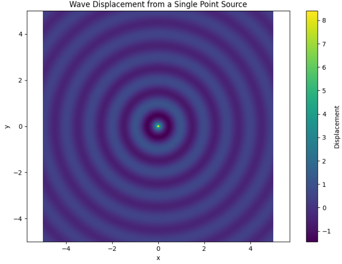
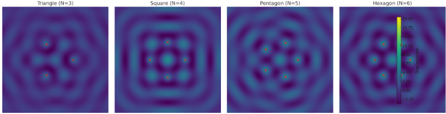
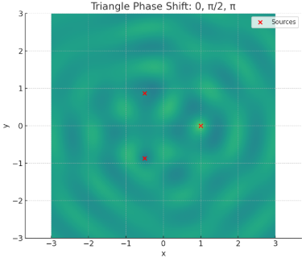
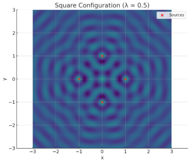
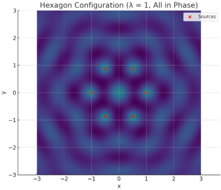
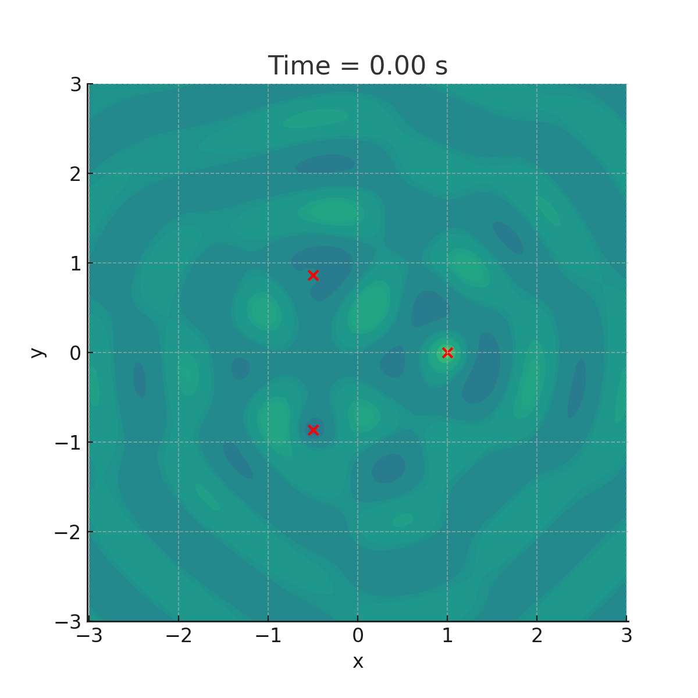

# Problem 1
# Interference Patterns on a Water Surface using Point Sources
1. Introduction
Wave phenomena are fundamental to understanding a wide range of natural and engineered systems — from the ripples on a pond to the propagation of light and sound. When multiple waves originating from different sources overlap on a common medium, such as a water surface, their amplitudes combine according to the principle of superposition. This interaction results in interference patterns, which can be either constructive (amplifying the wave) or destructive (cancelling it out), depending on the relative phases and path differences of the waves.

On a water surface, these patterns manifest visually as regions of alternating high and low wave amplitudes, often forming symmetrical and aesthetically striking structures. These interference effects are not only visually compelling but are also crucial for understanding real-world systems in areas such as acoustics (e.g., sound localization), optics (e.g., diffraction patterns), radio wave transmission, and even quantum mechanics (e.g., the famous double-slit experiment).

This project focuses on the simulation and analysis of such interference patterns, specifically when the wave sources are arranged at the vertices of regular polygons — such as triangles, squares, and hexagons. By imposing geometric symmetry, we can both simplify the analysis and highlight the beautiful structure that emerges from such configurations.

Through mathematical modeling and numerical simulation, we aim to:

Accurately describe wave propagation using fundamental wave equations.

Apply the principle of superposition to model the resulting displacement field on the water surface.

Visualize how different source configurations influence the complexity and symmetry of the interference pattern.

Explore the effects of key parameters such as wavelength, frequency, phase, and number of sources.

In addition to deepening our understanding of classical wave mechanics, this exploration also provides a valuable foundation for more advanced studies involving wave optics, signal interference, and even metamaterials. The use of modern computational tools like Python and Matplotlib allows us to simulate these physical phenomena in a controlled and visually interpretable manner — bridging theoretical physics with hands-on experimentation.


## 2. Wave Equation for a Point Source

To understand how interference patterns emerge on a water surface, we must first consider the behavior of a wave generated by a **single point source**. This source emits **circular wavefronts** that propagate radially outward in all directions. As these waves travel through the medium, they carry energy and produce oscillations in the water surface.

In an ideal, non-dissipative medium, the displacement at a point $(x, y)$ on the surface at time $t$ due to this source is given by the classical wave equation:

$$
y(x, y, t) = \frac{A}{\sqrt{r}} \cos(k r - \omega t + \phi)
$$

This equation describes a **harmonic wave** that travels outward from the source. The amplitude of the wave decreases with distance due to energy spreading, modeled by the $\frac{1}{\sqrt{r}}$ term.

---

### 🔎 Explanation of Terms

- **$A$**: Amplitude — the maximum displacement of the wave at its source. Physically, it represents the energy input into the system.
  
- **$r$**: Radial distance between the point of observation $(x, y)$ and the wave source $(x_s, y_s)$:

  $$
  r = \sqrt{(x - x_s)^2 + (y - y_s)^2}
  $$

- **$k$**: Wave number — related to the wavelength $\lambda$ by:

  $$
  k = \frac{2\pi}{\lambda}
  $$

  It determines how many wave crests occur per unit length.

- **$\omega$**: Angular frequency — related to the temporal frequency $f$ by:

  $$
  \omega = 2\pi f
  $$

  It determines how fast the wave oscillates over time.

- **$\phi$**: Initial phase — defines the starting point of the wave's oscillation at $t = 0$. If multiple sources are present, $\phi$ becomes crucial for phase relationships.

- **$\cos(k r - \omega t + \phi)$**: Describes the wave’s periodic nature in space and time. As time evolves, the argument of the cosine shifts, simulating outward motion.

- **$\frac{1}{\sqrt{r}}$**: Models the decrease in amplitude due to two-dimensional **geometric spreading**. In water, energy distributes over a growing circle, so intensity weakens with distance.

---

###  Physical Meaning

This wave function models a **monochromatic (single-frequency)** source. All the properties are time-invariant except the cosine term, which governs the oscillatory nature. Such a setup can be visualized as **dropping a stone into a calm pond**: the resulting ripple pattern closely follows this equation.

In real systems (e.g., wave tanks or shallow water experiments), this formula approximates behavior very well for short distances and low viscosity fluids.

---

###  Visualization with Python (Matplotlib)

The following Python code plots the wave displacement caused by a single point source at the origin $(0, 0)$. The intensity is shown as a color map, with concentric rings indicating wave crests and troughs:

```python
import numpy as np
import matplotlib.pyplot as plt

# Parameters
A = 1
λ = 1
k = 2 * np.pi / λ
f = 1
ω = 2 * np.pi * f
ϕ = 0
x_s, y_s = 0, 0

# Grid definition
x = np.linspace(-5, 5, 500)
y = np.linspace(-5, 5, 500)
X, Y = np.meshgrid(x, y)
R = np.sqrt((X - x_s)**2 + (Y - y_s)**2)

# Calculate displacement
Y_disp = A / np.sqrt(R + 1e-6) * np.cos(k * R - ϕ)

# Plot
plt.figure(figsize=(8, 6))
plt.contourf(X, Y, Y_disp, levels=200, cmap='viridis')
plt.title("Wave Displacement from a Single Point Source")
plt.xlabel("x")
plt.ylabel("y")
plt.colorbar(label="Displacement")
plt.axis('equal')
plt.tight_layout()
plt.show()
```


## 3. Superposition Principle

In wave physics, the **superposition principle** is one of the most fundamental concepts. It states that when two or more waves travel through the same medium at the same time, the resulting displacement at any point is the **algebraic sum** of the displacements due to the individual waves.

When multiple wave sources exist, each contributing its own disturbance to the medium, the total wave pattern is the result of all these contributions interacting — reinforcing or canceling each other out depending on their phase relationships.

Mathematically, for $N$ point sources, the total displacement at a point $(x, y)$ on the surface at time $t$ is given by:

$$
y_{\text{total}}(x, y, t) = \sum_{i=1}^N \frac{A}{\sqrt{r_i}} \cos(k r_i - \omega t + \phi)
$$

Where:

- $A$ is the amplitude of each source (assumed equal),
- $r_i$ is the distance between the $i$-th source and the observation point $(x, y)$,
- $k$ is the wave number: $k = \frac{2\pi}{\lambda}$,
- $\omega$ is the angular frequency: $\omega = 2\pi f$,
- $\phi$ is the phase of the wave (same or different for each source, depending on coherence).

The term $\frac{1}{\sqrt{r_i}}$ again accounts for the radial decay of wave amplitude in two dimensions.

---

### Constructive and Destructive Interference

When the wavefronts from different sources **align in phase**, their amplitudes **add** constructively. This leads to **bright or high-intensity regions** on the water surface.

If the waves are **out of phase** by $\pi$ (180°), they cancel each other out, creating **destructive interference**, observed as **dark or still regions**.

#### Example Conditions:

- **Constructive Interference**:
  
  $$
  \Delta r = m \lambda \quad (m \in \mathbb{Z})
  $$

- **Destructive Interference**:

  $$
  \Delta r = \left(m + \frac{1}{2}\right) \lambda
  $$

Where $\Delta r$ is the path difference between waves from two sources.

---

###  Why It Matters

Understanding superposition allows us to:

- Predict the **interference pattern** produced by multiple sources.
- Analyze the effects of **phase shifts** and **spacing** between sources.
- Simulate real-world wave behaviors like diffraction, resonance, and standing waves.

The resulting interference pattern depends heavily on the **geometry** of the source configuration and on their **relative phases**.

This principle is the core engine behind the visual beauty of multi-source wave systems — from ripples in water to light diffraction and even quantum interference.


---

## 4. Configurations of Sources: Regular Polygons

To explore how **symmetry** and **source arrangement** affect interference patterns, we consider placing point wave sources at the vertices of **regular polygons**. These symmetrical arrangements allow us to observe how geometry influences the resulting wave field.

We examine the following configurations:

- **Equilateral Triangle**: $( N = 3 )$
- **Square**: $( N = 4 )$
- **Regular Pentagon**: $( N = 5 )$
- **Regular Hexagon**: $( N = 6 )$

Each of these polygons has equal-length sides and equal interior angles, meaning the sources are **evenly distributed** around a circle — forming what’s known as a **circular source array**.

---

### Mathematical Setup

The coordinates of the $( i )$-th source positioned around a unit circle are given by:

$$
(x_i, y_i) = \left( R \cos\left( \frac{2\pi i}{N} \right),\ R \sin\left( \frac{2\pi i}{N} \right) \right)
\quad \text{for } i = 0, 1, ..., N-1
$$

Where:
- $( R )$ is the distance from the center to each vertex (radius),
- $( N )$ is the number of sources.

---

###  Wave Superposition

For a given observation point  (x, y) , the total wave displacement is calculated using the superposition principle:

$$
y_{\text{total}}(x, y, t) = \sum_{i=1}^{N} \frac{A}{\sqrt{r_i}} \cos(k r_i - \omega t + \phi)
$$

Where:
- $( r_i = \sqrt{(x - x_i)^2 + (y - y_i)^2} )$ is the distance from source $( i )$ to the observation point.

---

###  Assumptions

- All sources emit waves of **equal amplitude** $( A )$.
- They oscillate at the **same frequency** $( f )$ and **wavelength** $( \lambda )$.
- The sources are **coherent**, meaning their phase difference remains constant (e.g., all in phase).

These assumptions allow clean, symmetric interference patterns to form — ideal for theoretical analysis and simulation.

---

###  Visualization of Polygonal Configurations

Below is a comparison of interference patterns for polygonal source arrangements. Each red dot represents a point source placed at a vertex of the polygon. The color map shows areas of **constructive** and **destructive** interference.



#### Observations:
- **Triangle (N=3)**: Basic symmetrical structure with 3-fold rotational symmetry.
- **Square (N=4)**: More complex, with additional symmetry axes.
- **Pentagon (N=5)**: Dense fringe regions emerge; less intuitive symmetry.
- **Hexagon (N=6)**: High-order symmetry; intricate interference mesh.

As $( N )$ increases, the **spatial frequency** of the interference increases, creating denser and more complex patterns.

---

### Why Use Polygonal Sources?

- **Experimental simplicity**: Easy to set up in physical labs (e.g., water tank with synchronized droppers).
- **Analytical symmetry**: Makes mathematical analysis easier due to rotational invariance.
- **Real-world relevance**: Mimics circular speaker arrays, antenna setups, and even molecular arrangements in quantum mechanics.


## 5. Python Simulation Code (Google Colab Compatible)

```python
import numpy as np
import matplotlib.pyplot as plt

# Wave parameters
A = 1
wavelength = 1
k = 2 * np.pi / wavelength
f = 1
omega = 2 * np.pi * f
phi = 0

# Function to generate polygon vertices
def polygon_vertices(n, radius=1):
    return np.array([
        [radius * np.cos(2 * np.pi * i / n), radius * np.sin(2 * np.pi * i / n)]
        for i in range(n)
    ])

# Function to compute superposed wave
def wave_superposition(X, Y, sources, t=0):
    total = np.zeros_like(X)
    for sx, sy in sources:
        r = np.sqrt((X - sx)**2 + (Y - sy)**2)
        total += A / np.sqrt(r + 1e-9) * np.cos(k * r - omega * t + phi)
    return total

# Grid setup
x = np.linspace(-2, 2, 600)
y = np.linspace(-2, 2, 600)
X, Y = np.meshgrid(x, y)

# Visualization function
def plot_pattern(n_sources):
    sources = polygon_vertices(n_sources)
    Z = wave_superposition(X, Y, sources, t=0)
    plt.figure(figsize=(8, 6))
    plt.contourf(X, Y, Z, levels=200, cmap='viridis')
    plt.colorbar(label='Wave Displacement')
    plt.scatter(*sources.T, color='red', label='Sources')
    plt.legend()
    plt.title(f'Interference Pattern: {n_sources} Point Sources')
    plt.xlabel('x')
    plt.ylabel('y')
    plt.axis('equal')
    plt.tight_layout()
    plt.show()

# Example: Equilateral Triangle
plot_pattern(3)
``` 



