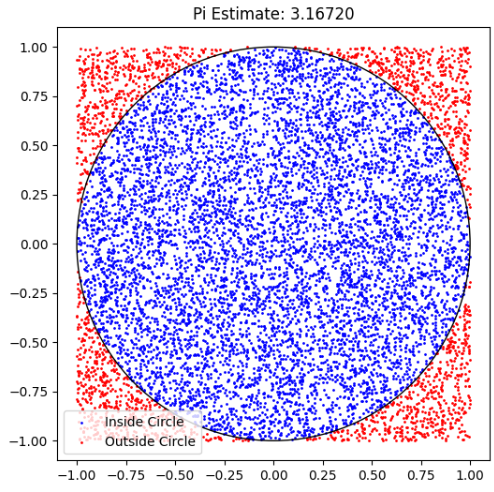
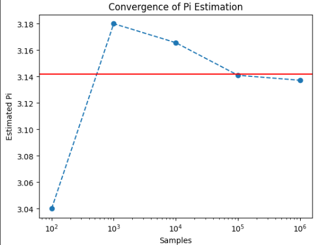

# Problem 2


# Estimating $\pi$ using Monte Carlo Methods

## Motivation
Monte Carlo simulations are a powerful computational technique to estimate values using randomness. A classic example is estimating $\pi$ through geometric probability.

---

## Part 1: Estimating $\pi$ Using a Circle

---

### Theoretical Foundation

Given a unit circle inscribed inside a square:

- The square has side length $2$, so:
  $$
  A_{square} = (2r)^2 = 2^2 = 4
  $$
- The circle has radius $r = 1$, so:
  $$
  A_{circle} = \pi r^2 = \pi \cdot 1^2 = \pi
  $$
- Therefore, the ratio of the areas is:
  $$
  \frac{A_{circle}}{A_{square}} = \frac{\pi}{4}
  $$

---

This ratio $\frac{\pi}{4}$ represents the **probability** that a random point selected inside the square will fall inside the circle.

- Points inside the circle satisfy:
  $$
  x^2 + y^2 \leq 1
  $$
- Points outside the circle satisfy:
  $$
  x^2 + y^2 > 1
  $$

---

### Estimating $\pi$:

We can estimate $\pi$ by using the ratio of points inside the circle to the total number of points generated.

Let:
- $N$ = total number of points
- $N_{circle}$ = number of points that fall inside the circle

Then:
$$
\frac{N_{circle}}{N} \approx \frac{\pi}{4}
$$

Rearranging to estimate $\pi$:
$$
\pi \approx 4 \times \frac{N_{circle}}{N}
$$

---

### Why Multiply by 4?

We multiply by 4 because:
- The area ratio $\frac{\pi}{4}$ comes from comparing the circle to the square.
- To isolate $\pi$, we multiply both sides by 4.

Thus:
$$
\pi = 4 \times \frac{N_{circle}}{N}
$$

This formula becomes more accurate as $N$ increases, following the **Law of Large Numbers**.

---

### Key Formula (Summary):
$$
\pi \approx 4 \times \frac{\text{Points inside circle}}{\text{Total points}}
$$


### Python Simulation
```python
import numpy as np
import matplotlib.pyplot as plt

def monte_carlo_pi(num_points):
    x = np.random.uniform(-1, 1, num_points)
    y = np.random.uniform(-1, 1, num_points)
    inside = (x**2 + y**2) <= 1
    pi_estimate = 4 * np.sum(inside) / num_points
    return pi_estimate, x, y, inside
```
### Visualization
```python
pi_value, x, y, inside = monte_carlo_pi(10000)
plt.figure(figsize=(6,6))
plt.scatter(x[inside], y[inside], s=1, color='blue', label='Inside Circle')
plt.scatter(x[~inside], y[~inside], s=1, color='red', label='Outside Circle')
plt.gca().add_patch(plt.Circle((0,0), 1, fill=False, color='black'))
plt.title(f'Pi Estimate: {pi_value:.5f}')
plt.axis('square')
plt.legend()
plt.show()
```

### Convergence
```python
sizes = [100, 1000, 10000, 100000, 1000000]
estimates = [monte_carlo_pi(n)[0] for n in sizes]

plt.plot(sizes, estimates, marker='o', linestyle='--')
plt.axhline(np.pi, color='r', linestyle='-')
plt.xscale('log')
plt.xlabel('Samples')
plt.ylabel('Estimated Pi')
plt.title('Convergence of Pi Estimation')
plt.show()
```

---

# Buffon's Needle Problem: Estimating $\pi$ with Geometry and Probability

## 📖 Introduction

Buffon's Needle is one of the oldest problems in geometric probability, introduced by the French mathematician **Georges-Louis Leclerc, Comte de Buffon** in the 18th century. 

What makes this problem fascinating is that it connects **geometry, probability, and $\pi$** in a very intuitive yet surprising way.

Unlike traditional methods of estimating $\pi$ through geometry (such as areas of circles), Buffon's Needle provides a **probabilistic experiment** to approximate $\pi$ by dropping a needle onto a plane ruled with parallel lines and observing how often it crosses them.

---

## 📝 Problem Setup

Imagine a floor (or a plane) with **parallel lines** drawn on it. These lines are:
- Equally spaced with a distance **$D$** between them.

Now, take a **needle of length $L$** (with $L < D$, meaning the needle is shorter than the distance between the lines).

### Experiment Procedure:
1. Drop the needle randomly onto the floor.
2. Observe whether the needle **crosses one of the parallel lines**.
3. Repeat the process many times and **count the number of crossings**.

Over a large number of trials, we can use the proportion of crossings to estimate the value of $\pi$.

---

## 📐 Mathematical Derivation

The probability that the needle crosses one of the lines is given by:

$$
P_{cross} = \frac{2L}{D \cdot \pi}
$$

### Rearranging to Estimate $\pi$:
If we perform $N_{throws}$ needle drops and count $N_{cross}$ crossings, we can rearrange the equation to approximate $\pi$ as:

$$
\pi \approx \frac{2L \cdot N_{throws}}{D \cdot N_{cross}}
$$

### Where:
- $L$ = Length of the needle
- $D$ = Distance between the parallel lines
- $N_{throws}$ = Total number of needle drops
- $N_{cross}$ = Number of times the needle crosses a line

---

## 🧐 Why Does This Work?

The underlying principle involves the **random orientation** of the needle and its **random distance to the nearest line**.

When we drop the needle, two things are random:
- The **distance** of the needle's center to the nearest line: uniformly distributed between $0$ and $\frac{D}{2}$.
- The **angle** the needle makes with the parallel lines: uniformly distributed between $0$ and $\frac{\pi}{2}$.

By integrating over all possible positions and angles (using **integral geometry**), we find that the expected number of crossings relates directly to $\pi$.

This surprising connection allows us to **estimate $\pi$ experimentally** using this method.

---

## ✅ Practical Considerations

- The method becomes more accurate with a **large number of trials**.
- For short needles ($L < D$), the derived formula is exact.
- For longer needles, more complex formulas are needed.
- This method is also sensitive to **random number generation quality**.
